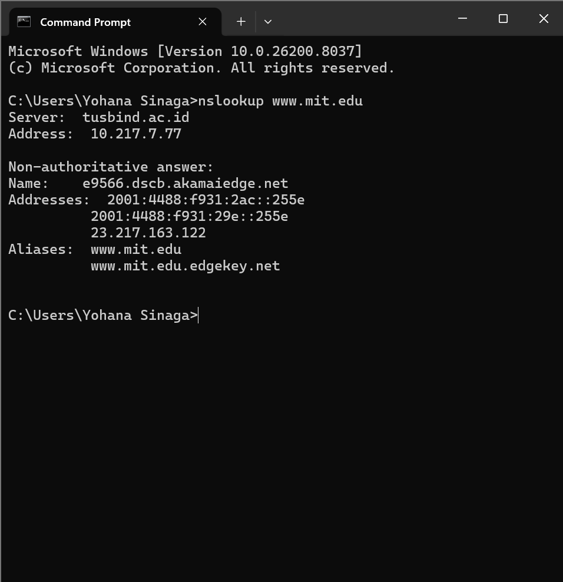
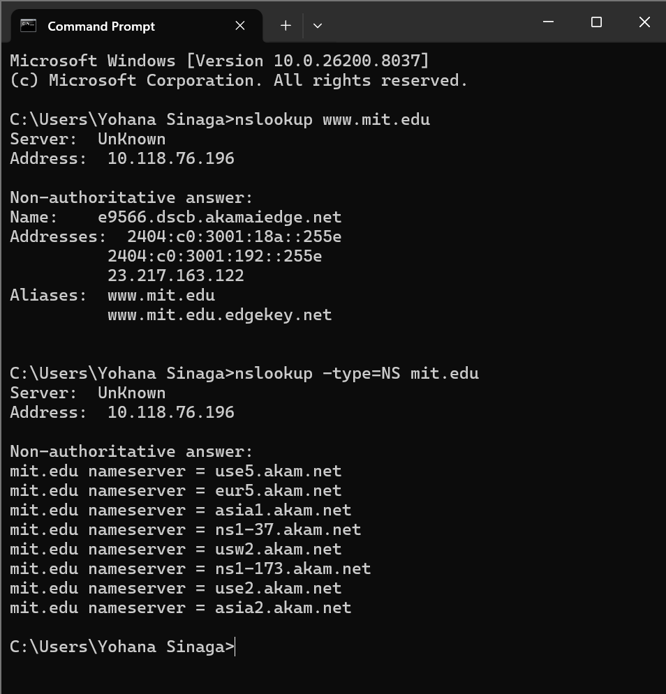
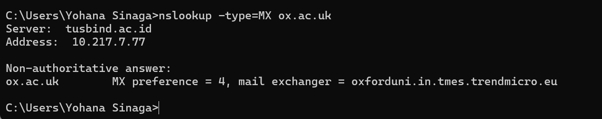
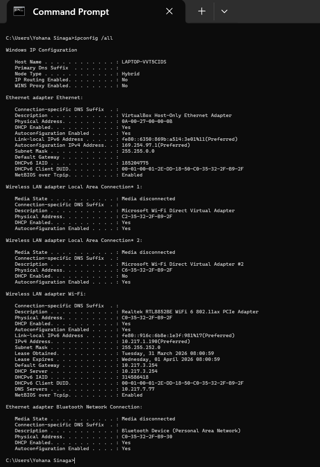
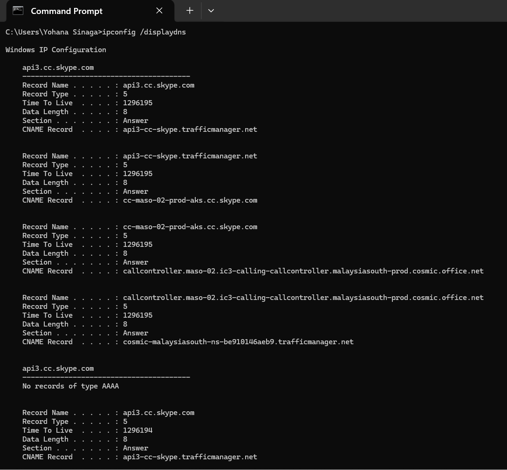
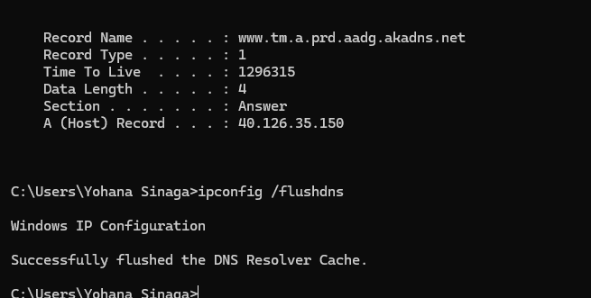
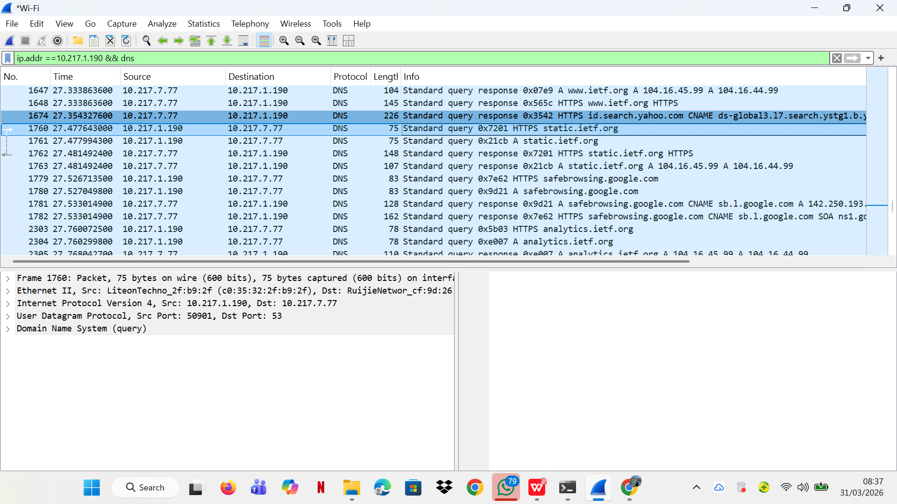
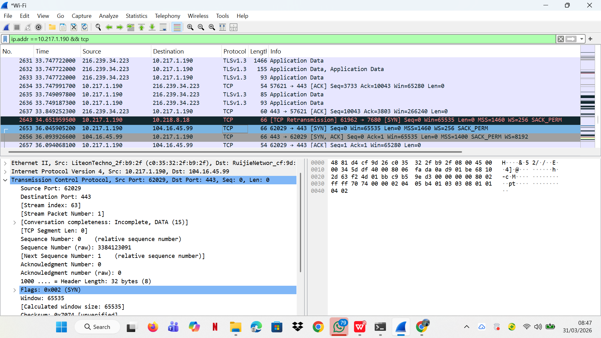

# Laporan Praktikum Jaringan Komputer - Modul 4
## Domain Name System (DNS)

### Identitas Praktikan
| Item | Keterangan |
|------|------------|
| **Nama** | Yohana Sinaga |
| **NIM** | 103072400009 |
| **Kelas** | IF-04-01 |

---

## 4.1 Tujuan Praktikum
1. Memahami cara kerja DNS dan hierarki resolusi nama domain.
2. Menggunakan `nslookup` untuk query berbagai jenis record DNS (A, NS, MX).
3. Menganalisis paket DNS menggunakan Wireshark.
4. Memahami konsep DNS cache dan TTL.

---

## 4.2 Praktikum: Query DNS dengan nslookup

### 4.2.1 Query A Record (Basic Lookup)
```bash
nslookup www.mit.edu
```
**Hasil:**
```
Server:  tusbind.ac.id
Address: 10.217.7.77

Non-authoritative answer:
Name:    e9566.dscb.akamaiedge.net
Addresses: 2001:4488:f931:2ac::255e
           2001:4488:f931:29e::255e
           23.217.163.122
Aliases: www.mit.edu
         www.mit.edu.edgekey.net
```


**Poin Penting:**
- DNS lokal yang digunakan adalah `tusbind.ac.id` dengan IP `10.217.7.77`
- Jawaban bersifat *non-authoritative* (dari cache, bukan server otoritatif langsung)
- Terjadi **CNAME chaining**: `www.mit.edu` → `www.mit.edu.edgekey.net` → `e9566.dscb.akamaiedge.net`
- MIT menggunakan **Akamai CDN** sehingga IP yang dikembalikan adalah server edge Akamai
- Mendukung **dual-stack**: IPv4 (`23.217.163.122`) dan dua IPv6 (`2001:4488:f931:2ac::255e`, `2001:4488:f931:29e::255e`)

---

### 4.2.2 Query NS Record (Name Server)
```bash
nslookup -type=NS mit.edu
```
**Hasil:**
```
Server:  UnKnown
Address: 10.118.76.196

Non-authoritative answer:
mit.edu   nameserver = use5.akam.net
mit.edu   nameserver = eur5.akam.net
mit.edu   nameserver = asia1.akam.net
mit.edu   nameserver = ns1-37.akam.net
mit.edu   nameserver = usw2.akam.net
mit.edu   nameserver = ns1-173.akam.net
mit.edu   nameserver = use2.akam.net
mit.edu   nameserver = asia2.akam.net
```


**Analisis:**
- DNS server yang digunakan menampilkan nama "UnKnown" dengan IP `10.118.76.196`
- Terdapat **8 nameserver otoritatif** untuk domain `mit.edu`, semuanya milik Akamai
- Persebaran nameserver mencakup region **US** (use2, use5, usw2), **Europe** (eur5), dan **Asia** (asia1, asia2) → untuk redundansi global
- MIT sepenuhnya mengandalkan infrastruktur DNS Akamai untuk ketersediaan tinggi

---

### 4.2.3 Query MX Record (Mail Server)
```bash
nslookup -type=MX ox.ac.uk
```
**Hasil:**
```
Server:  tusbind.ac.id
Address: 10.217.7.77

Non-authoritative answer:
ox.ac.uk   MX preference = 4, mail exchanger = oxforduni.in.tmes.trendmicro.eu
```


**Catatan:**
- Domain yang diquery adalah `ox.ac.uk` (University of Oxford)
- Angka `4` = nilai preferensi/priority (semakin kecil, semakin diprioritaskan)
- Mail exchanger mengarah ke **Trend Micro** (`tmes.trendmicro.eu`) — Oxford menggunakan layanan **Trend Micro Email Security** sebagai gateway email
- Ini menunjukkan praktik umum institusi besar: email diproses oleh filter keamanan pihak ketiga sebelum masuk ke server internal

---

## 4.3 Manajemen DNS Cache (Windows)

| Perintah | Fungsi | Output Singkat |
|----------|--------|---------------|
| `ipconfig /all` | Tampilkan konfigurasi jaringan lengkap | IP, Gateway, DNS Server |
| `ipconfig /displaydns` | Lihat cache DNS lokal | Daftar domain + TTL tersisa |
| `ipconfig /flushdns` | Hapus cache DNS | "Successfully flushed" |

### 4.3.1 Hasil `ipconfig /all`
```
Host Name  . . . . . . . . : LAPTOP-VVT5CIDS
Node Type  . . . . . . . . : Hybrid
IP Routing Enabled . . . . : No

Wireless LAN adapter Wi-Fi:
   Description  . . . . . . : Realtek RTL8852BE WiFi 6 802.11ax PCIe Adapter
   Physical Address . . . . : C0-35-32-2F-B9-2F
   DHCP Enabled . . . . . . : Yes
   IPv4 Address . . . . . . : 10.217.1.190
   Subnet Mask  . . . . . . : 255.255.252.0
   Default Gateway  . . . . : 10.217.3.254
   DHCP Server  . . . . . . : 10.217.3.254
   DNS Servers  . . . . . . : 10.217.7.77
   Lease Obtained . . . . . : Tuesday, 31 March 2026 08:00:59
   Lease Expires  . . . . . : Wednesday, 01 April 2026 08:00:59
```


**Analisis:**
- IP komputer: `10.217.1.190` dengan subnet mask `255.255.252.0` (/22)
- DNS Server aktif: `10.217.7.77` — konsisten dengan DNS server yang muncul pada query `nslookup` sebelumnya (`tusbind.ac.id`)
- IP diperoleh via **DHCP** dari gateway `10.217.3.254` dengan masa sewa 1 hari (31 Maret → 1 April 2026)
- Adapter Wi-Fi menggunakan chipset **Realtek RTL8852BE**, mendukung WiFi 6 (802.11ax)

---

### 4.3.2 Hasil `ipconfig /displaydns`
```
api3.cc.skype.com
   Record Type  . . . : 5 (CNAME)
   Time To Live . . . : 1296195
   CNAME Record . . . : api3-cc-skype.trafficmanager.net

   Record Type  . . . : 5 (CNAME)
   Time To Live . . . : 1296195
   CNAME Record . . . : cc-maso-02-prod-aks.cc.skype.com

   Record Type  . . . : 5 (CNAME)
   Time To Live . . . : 1296195
   CNAME Record . . . : callcontroller.maso-02.ic3-calling-callcontroller.malaysiasouth-prod.cosmic.office.net

   Record Type  . . . : 5 (CNAME)
   Time To Live . . . : 1296195
   CNAME Record . . . : cosmic-malaysiasouth-ns-be910146aeb9.trafficmanager.net
```


**Analisis:**
- Cache DNS berisi entri untuk `api3.cc.skype.com` (Microsoft Teams/Skype API)
- Terlihat **CNAME chaining** panjang: `api3.cc.skype.com` → `trafficmanager.net` → `cc.skype.com` → `cosmic.office.net` → `trafficmanager.net` lagi
- TTL sangat besar (`1296195` detik ≈ **15 hari**) → Microsoft menetapkan cache lama agar client tidak sering melakukan query ulang
- Region `malaysiasouth` menunjukkan koneksi diarahkan ke data center Microsoft di Asia Tenggara

---

### 4.3.3 Hasil `ipconfig /flushdns`
```
A (Host) Record . . . : 40.126.35.150

Successfully flushed the DNS Resolver Cache.
```


**Analisis:**
- Sebelum flush, terlihat entri terakhir cache: A Record dengan IP `40.126.35.150` (milik Microsoft Azure)
- Setelah perintah `ipconfig /flushdns`, seluruh cache DNS lokal berhasil dihapus dengan pesan *"Successfully flushed the DNS Resolver Cache"*
- Flush DNS penting dilakukan sebelum capture Wireshark agar proses resolusi DNS dapat teramati dari awal, bukan dari cache

---

## 4.4 Analisis Paket DNS dengan Wireshark

### 4.4.1 Capture DNS Traffic (Akses www.ietf.org)
**Langkah:**
1. `ipconfig /flushdns` → bersihkan cache
2. Start Wireshark capture (interface Wi-Fi)
3. Akses `http://www.ietf.org` di browser
4. Filter: `ip.addr == 10.217.1.190 && dns`

**Hasil Capture:**


| Parameter | Nilai |
|-----------|-------|
| IP Client | 10.217.1.190 |
| DNS Server | 10.217.7.77 |
| Protokol | UDP |
| Source Port (query) | 50901 (ephemeral) |
| Destination Port | 53 |
| Query Type | A, AAAA, HTTPS |

**Paket yang teramati:**
```
No. 1647 - Response: www.ietf.org A 104.16.45.99, A 104.16.44.99
No. 1648 - Response: www.ietf.org HTTPS record
No. 1760 - Query: static.ietf.org HTTPS
No. 1761 - Query: static.ietf.org A
No. 1762 - Response: static.ietf.org HTTPS
No. 1763 - Response: static.ietf.org A 104.16.45.99, A 104.16.44.99
```

**Poin Analisis:**
- DNS menggunakan **UDP port 53** untuk semua query standar
- Client `10.217.1.190` melakukan query ke DNS lokal `10.217.7.77`
- `www.ietf.org` mendapat dua IP: `104.16.45.99` dan `104.16.44.99` → keduanya milik **Cloudflare CDN**, untuk load balancing
- Terlihat query tipe **HTTPS** (record tipe 65) — mekanisme modern untuk SVCB/HTTPS service binding
- Browser juga otomatis query `static.ietf.org` untuk resource halaman (CSS, gambar, dll.)
- Setelah DNS response, client melanjutkan dengan **TCP SYN** ke IP hasil resolusi

---

### 4.4.2 Capture TCP Traffic Setelah DNS Resolution
**Filter Wireshark:**
```
ip.addr == 10.217.1.190 && tcp
```

**Hasil:**


**Detail Paket TCP SYN (No. 2653):**
| Parameter | Nilai |
|-----------|-------|
| Source IP | 10.217.1.190 |
| Destination IP | 104.16.45.99 |
| Destination Port | 443 (HTTPS) |
| Flags | SYN (0x002) |
| Sequence Number | 0 (relative) |
| Window Size | 65535 |
| Header Length | 32 bytes |

**Alur koneksi lengkap yang teramati:**
```
1. DNS Query  → 10.217.1.190 mengirim query ke 10.217.7.77 (UDP port 53)
2. DNS Response ← 10.217.7.77 membalas: www.ietf.org = 104.16.45.99
3. TCP SYN    → 10.217.1.190 : 62029 → 104.16.45.99 : 443
4. TCP SYN-ACK ← 104.16.45.99 → 10.217.1.190 (ACK)
5. TLSv1.3 Application Data → koneksi HTTPS terenkripsi berhasil
```

**Analisis:**
- Setelah resolusi DNS selesai, client langsung memulai **TCP 3-way handshake** ke port 443 (HTTPS)
- Wireshark menampilkan detail seluruh layer: Ethernet II → IPv4 → TCP → TLS, membuktikan konsep **encapsulation**
- Paket **TLSv1.3** terlihat aktif (Application Data dari `216.239.34.223`) menandakan sesi HTTPS sudah berjalan sebelum capture ini
- Terdapat `[TCP Retransmission]` ke IP `10.218.8.18` port 7680 — ini adalah koneksi lain yang timeout, bukan bagian dari akses ietf.org

---

## 4.5 Ringkasan Hasil Praktikum

| Parameter | Nilai / Keterangan |
|-----------|-------------------|
| Protokol DNS | UDP port 53 |
| DNS Server Kampus | tusbind.ac.id (10.217.7.77) |
| Query Type yang diuji | A, AAAA, NS, MX, HTTPS |
| CNAME Chaining | Terjadi pada mit.edu (Akamai) dan api3.cc.skype.com (Azure) |
| Multiple IP per domain | Ya → load balancing Cloudflare (ietf.org) |
| DNS Cache TTL | Detik hingga 15 hari (Skype/Microsoft) |
| IP Client | 10.217.1.190 (DHCP, subnet /22) |
| Tools utama | `nslookup`, `ipconfig`, Wireshark |

---

## 4.6 Kesimpulan Praktis

1. DNS menerjemahkan nama domain → IP melalui hierarki resolver. DNS server kampus `tusbind.ac.id` (10.217.7.77) bertindak sebagai resolver pertama sebelum meneruskan ke server otoritatif.
2. `nslookup` efektif untuk query record A (IP), NS (name server), dan MX (mail server). Domain besar seperti MIT menggunakan Akamai CDN, sedangkan Oxford menggunakan Trend Micro untuk keamanan email.
3. DNS menggunakan **UDP port 53** karena ringan dan cepat. Proses ini selalu mendahului koneksi TCP/HTTPS.
4. **CNAME chaining** umum terjadi pada domain yang menggunakan CDN — terlihat pada `www.mit.edu` (2 level CNAME ke Akamai) dan `api3.cc.skype.com` (4 level CNAME ke Azure).
5. **DNS cache** menyimpan hasil resolusi sesuai TTL untuk menghindari query berulang. `ipconfig /flushdns` menghapus cache ini saat dibutuhkan.
6. Setelah DNS selesai, koneksi dilanjutkan dengan **TCP 3-way handshake** → **TLS handshake** → transfer data terenkripsi. Seluruh alur ini terlihat jelas di Wireshark.
7. Wireshark membuktikan secara visual bahwa DNS (UDP) dan HTTPS (TCP) bekerja secara berurutan dan saling bergantung dalam proses akses sebuah website.

---

## Daftar Pustaka
1. Kurose & Ross. *Computer Networking: A Top-Down Approach*. 8th Ed.
2. Postel, J. (1987). *RFC 1034 & 1035: Domain Name System*. IETF.
3. Modul Praktikum Jaringan Komputer, Universitas Telkom (2026).
4. Cloudflare. *What is DNS?* https://www.cloudflare.com/learning/dns/
5. Wireshark Docs: https://www.wireshark.org/docs/
```
