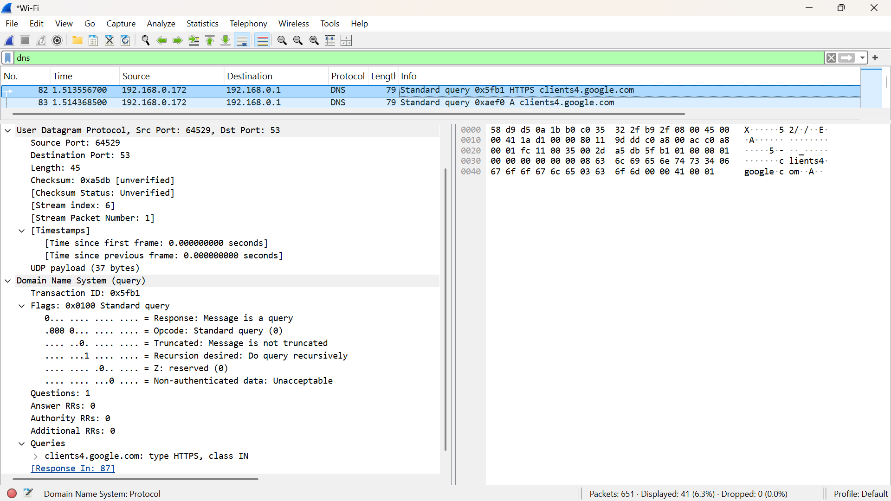
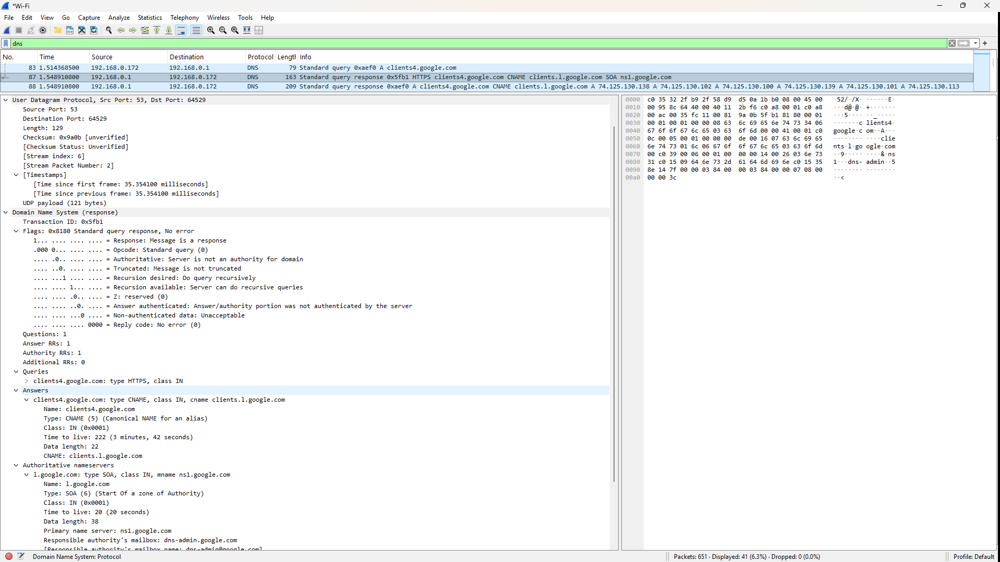

# Laporan Praktikum Jaringan Komputer - Modul 5
## User Datagram Protocol (UDP)

### Identitas Praktikan
| Item | Keterangan |
|------|------------|
| **Nama** | Yohana Sinaga |
| **NIM** | 103072400009 |
| **Kelas** | IF-04-01 |

---

## 5.1 Tujuan Praktikum
1. Investigasi cara kerja UDP menggunakan Wireshark.
2. Identifikasi struktur header UDP dan field-fieldnya.
3. Analisis hubungan port source-destination pada komunikasi UDP.
4. Hitung kapasitas maksimum payload UDP.

---

## 5.2 Langkah Kerja & Hasil

### 5.2.1 Capture Paket UDP

**Langkah:**
1. Buka Wireshark → pilih interface Wi-Fi → Start Capture
2. Jalankan perintah untuk memicu traffic UDP:
   ```bash
   ipconfig /flushdns
   nslookup google.com
   ```
3. Stop capture → terapkan filter:
   ```
   dns
   ```

**Hasil Capture:**

| Frame | Type | Source | Destination | Protocol | Length | Info |
|-------|------|--------|-------------|----------|--------|------|
| 82 | DNS Query | 192.168.0.172 | 192.168.0.1 | DNS | 79 | Standard query 0x5fb1 HTTPS clients4.google.com |
| 83 | DNS Response | 192.168.0.1 | 192.168.0.172 | DNS | 163 | Standard query response 0x5fb1 HTTPS clients4.google.com CNAME clients.l.google.com |





---

### 5.2.2 Analisis Header UDP

**Struktur Header (8 byte total):**
```
| Source Port (2B) | Dest Port (2B) | Length (2B) | Checksum (2B) |
```

**Hasil Analisis dari Wireshark:**

#### **DNS Query (Frame 82):**
- **Source Port:** 64529 (ephemeral port client)
- **Destination Port:** 53 (DNS server)
- **Length:** 45 bytes (UDP payload)
- **Checksum:** 0xa5db [unverified]
- **UDP Payload:** 45 - 8 = **37 bytes**

#### **DNS Response (Frame 83):**
- **Source Port:** 53 (DNS server)
- **Destination Port:** 64529 (ephemeral port client)
- **Length:** 129 bytes (UDP payload)
- **Checksum:** 0x9a0b [unverified]
- **UDP Payload:** 129 - 8 = **121 bytes**

**Detail DNS Query:**
- **Transaction ID:** 0x5fb1
- **Flags:** 0x0100 (Standard query)
- **Query:** clients4.google.com: type HTTPS, class IN
- **Recursion desired:** Yes

**Detail DNS Response:**
- **Transaction ID:** 0x5fb1 (sama dengan query)
- **Flags:** 0x8180 (Standard query response, No error)
- **Answer RRs:** 1
- **Authority RRs:** 1
- **CNAME:** clients4.google.com → clients.l.google.com
- **SOA:** ns1.google.com (Start of Authority)

---

### 5.2.3 Perhitungan Teknis UDP

| Parameter | Perhitungan | Hasil |
|-----------|-------------|-------|
| Maksimum Length (16-bit) | 2¹⁶ - 1 | **65.535 byte** |
| Maksimum Payload | 65.535 - 8 (header) | **65.527 byte** |
| Rentang Port | 0 - 2¹⁶ - 1 | **0 - 65.535** |
| Well-known ports | 0 - 1023 | DNS = 53 |
| Registered ports | 1024 - 49151 | - |
| Dynamic/Ephemeral ports | 49152 - 65535 | Client port 64529 |
| Protocol Number (IP Header) | - | **17 (0x11)** |

---

### 5.2.4 Pola Komunikasi Request-Response

**Mapping Port & IP:**
```
REQUEST:  192.168.0.172:64529 → 192.168.0.1:53
RESPONSE: 192.168.0.1:53      → 192.168.0.172:64529
```

**Poin Kunci:**
1. **Port reversal:** Port source response = port destination request (dan sebaliknya)
2. **Client ephemeral port:** 64529 (masuk range 49152-65535)
3. **Server well-known port:** 53 (DNS)
4. **Transaction ID matching:** 0x5fb1 sama pada query & response
5. **IP addresses:** Client (192.168.0.172) ↔ DNS Server (192.168.0.1)

**Hasil Query DNS:**
- **Query Type:** HTTPS (65) - RFC 8484 (HTTPS Resource Records)
- **Domain:** clients4.google.com
- **Response:** CNAME → clients.l.google.com
- **Authority:** SOA record dengan primary nameserver ns1.google.com
- **TTL:** 222 seconds (3 menit 42 detik) untuk CNAME
- **Indikasi:** Google menggunakan CNAME untuk load balancing dan manajemen layanan

---

## 5.3 Ringkasan Hasil

| Parameter | Nilai |
|-----------|-------|
| Jumlah field header UDP | 4 (Source Port, Dest Port, Length, Checksum) |
| Ukuran total header | 8 byte (fixed) |
| Payload query | 37 byte |
| Payload response | 121 byte |
| Maksimum payload teoritis | 65.527 byte |
| Maksimum payload praktis (Ethernet) | ~1472 byte |
| Rentang port | 0 - 65.535 |
| Protocol number UDP | 17 (0x11) |
| Pola port request-response | Dibalik (source ↔ destination) |
| Transaction ID | 0x5fb1 |
| Query domain | clients4.google.com |
| Response type | CNAME → clients.l.google.com |

---

## 5.4 Kesimpulan

1. **Header UDP minimalis:** Hanya **8 byte** (4 field × 2 byte) → overhead kecil, cocok untuk aplikasi real-time seperti DNS.

2. **Field Length mencakup header + payload:** Pada capture, query = 45 byte (37 byte payload + 8 byte header), response = 129 byte (121 byte payload + 8 byte header).

3. **Payload maksimum:** Secara teoritis **65.527 byte**, tapi untuk Ethernet dengan MTU 1500 byte, sebaiknya ≤ **1472 byte** agar tidak terjadi fragmentasi IP.

4. **Port management:** Port UDP range **0-65.535**; praktikum menggunakan port 53 (DNS server - well-known port) dan 64529 (ephemeral client port).

5. **Protocol identification:** UDP menggunakan protocol number **17 (0x11)** pada IP header.

6. **Pola komunikasi UDP:** Port source-destination **dibalik** pada response, dengan Transaction ID yang sama (0x5fb1) untuk matching query-response.

7. **DNS over UDP:** Query DNS menggunakan UDP karena ringan dan cepat. Query type HTTPS (65) menunjukkan implementasi modern DNS HTTPS Resource Records (RFC 8484).

8. **CNAME chaining:** Response menunjukkan `clients4.google.com` adalah alias ke `clients.l.google.com` → praktik umum untuk load balancing dan manajemen layanan Google.

9. **Wireshark efektif** untuk analisis langsung: melihat struktur header, menghitung payload, melacak alur request-response, dan memahami field-field protokol.

---

## Daftar Pustaka

1. Postel, J. (1980). *RFC 768: User Datagram Protocol*. IETF.
2. Huitema, C., et al. (2020). *RFC 8484: DNS Queries over HTTPS (DoH)*. IETF.
3. Modul Praktikum Jaringan Komputer, Universitas Telkom (2026).
4. Wireshark Documentation: https://www.wireshark.org/docs/
5. Kurose, J.F. & Ross, K.W. (2021). *Computer Networking: A Top-Down Approach*. 8th Edition.

---

