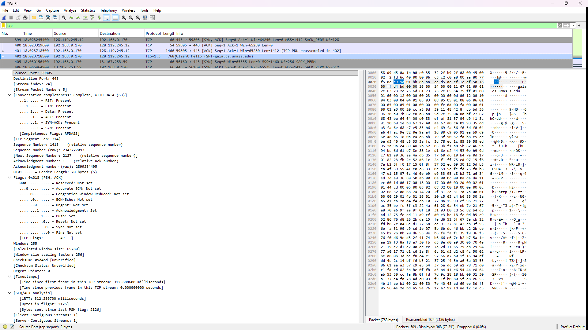
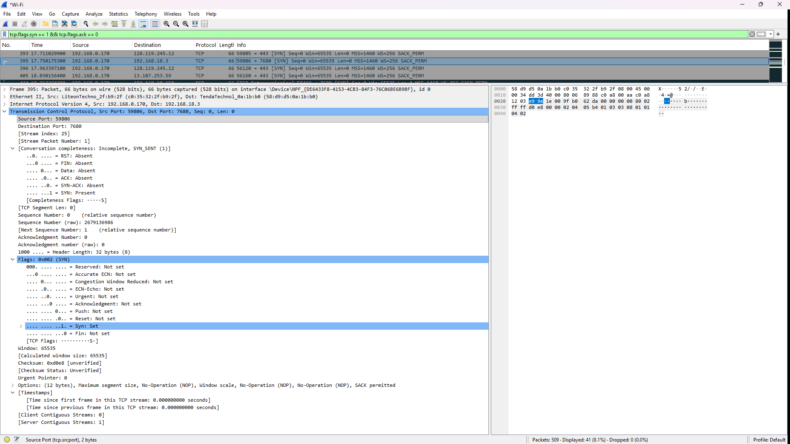
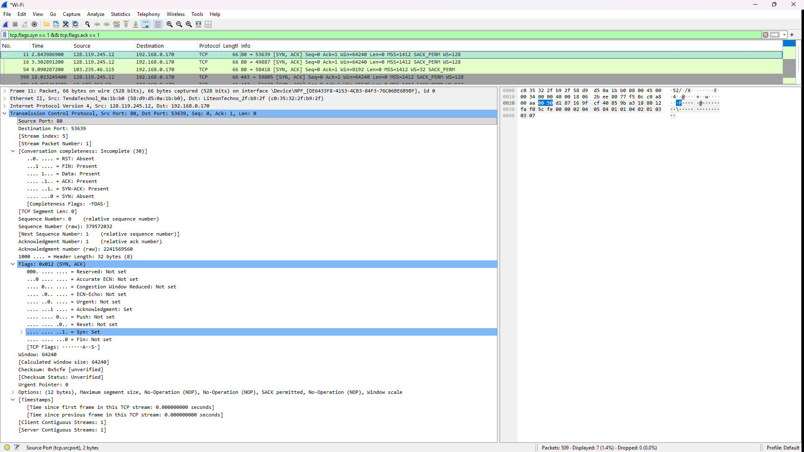
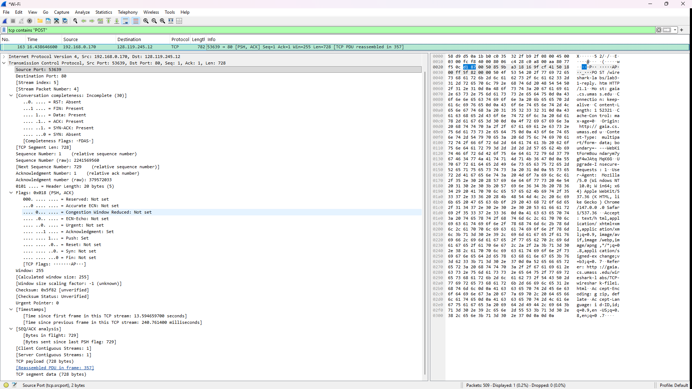
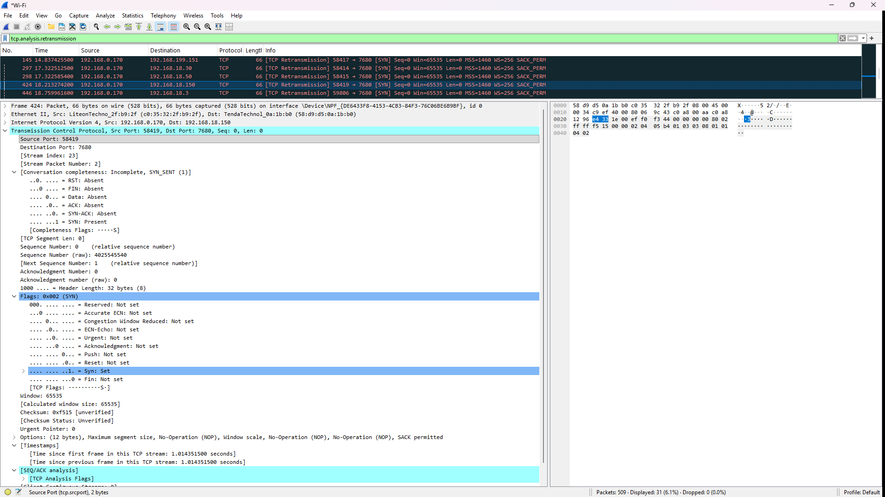
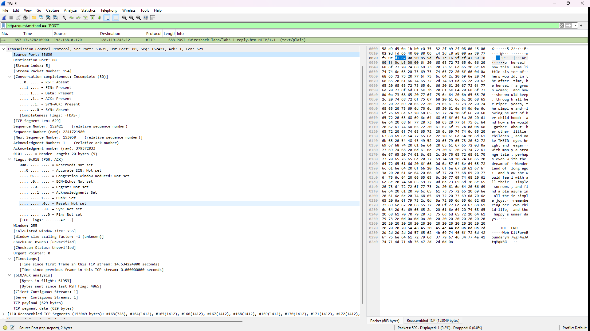
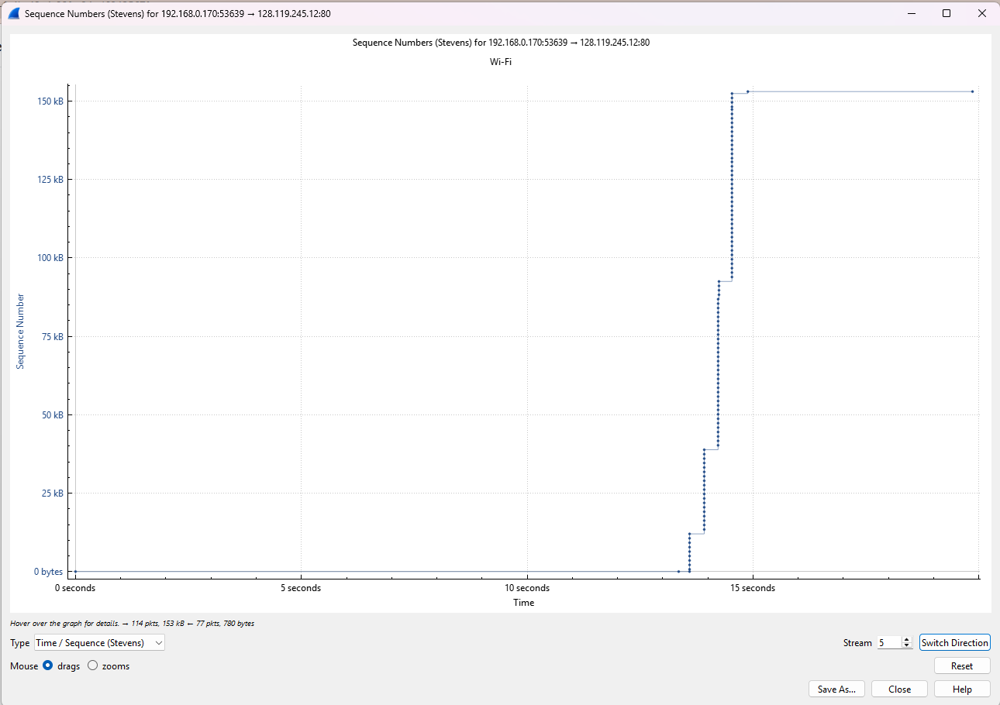

# Laporan Praktikum Jaringan Komputer - Modul 6
## Transmission Control Protocol (TCP) Analysis

### Identitas Praktikan

| Item | Keterangan |
|------|-----------|
| **Nama** | Yohana Sinaga |
| **NIM** | 103072400009 |
| **Kelas** | IF-04-01 |

---

## Tujuan Praktikum

1. Analisis cara kerja TCP menggunakan Wireshark
2. Identifikasi sequence number, acknowledgment, dan reliability mechanism
3. Amati congestion control (slow start & congestion avoidance)
4. Hitung throughput dan RTT koneksi TCP

---

## Langkah Kerja

1. Download file `alice.txt` dari server
2. Buka halaman upload di `http://gaia.cs.umass.edu/wireshark-labs/TCP-wireshark-file1.html`
3. Start Wireshark capture sebelum upload
4. Upload file alice.txt melalui browser
5. Stop capture setelah upload selesai
6. Filter paket: `tcp && ip.addr == 128.119.245.12`
7. Analisis handshake, segment, ACK, dan grafik

---

## Hasil Praktikum

### 1. Identitas Koneksi TCP



**Parameter Koneksi:**
- **Client IP:** 192.168.0.170
- **Client Port:** 59805
- **Server IP:** 128.119.245.12
- **Server Port:** 443 (HTTPS)

---

### 2. Three-Way Handshake

#### a. Paket SYN (Client → Server)



**Detail Paket SYN:**
| Field | Nilai |
|-------|-------|
| Sequence Number | 0 (relative) |
| Flags | SYN |
| MSS | 1460 bytes |
| Window Scale | ×256 |

#### b. Paket SYN-ACK (Server → Client)



**Detail Paket SYN-ACK:**
| Field | Nilai |
|-------|-------|
| Sequence Number | 0 |
| Acknowledgment | 1 |
| Flags | SYN, ACK |

#### c. Paket ACK (Client → Server)
- **Sequence:** 1
- **Acknowledgment:** 1
- **Flags:** ACK
- **Status:** Koneksi established, siap transfer data

---

### 3. HTTP POST Segment



**Detail Paket HTTP POST:**
| Field | Nilai |
|-------|-------|
| Frame Number | 163 |
| Source | 192.168.0.170:53639 |
| Destination | 128.119.245.12:80 |
| Sequence Number | 1 |
| Payload Size | 728 bytes |
| Flags | PSH, ACK |
| Window Size | 255 bytes |


### 4. Flow Control & Window Size



**Perhitungan Window Size:**
```
Window Value: 65535
Scale Factor: 256
Actual Window: 65535 × 256 = 16,776,960 bytes
```

**Hasil Analisis:**
- Window size tidak pernah mencapai 0
- Tidak ada zero-window condition
- Buffer receiver selalu tersedia

---

### 5. Retransmisi & Pola ACK

**Cek Retransmisi:**
```
Filter: tcp.analysis.retransmission
Hasil: ditemukan beberapa paket (No. 145, 297, 298, 424, 446)
```

#### Pola ACK



| Karakteristik | Observasi |
|--------------|-----------|
| ACK Type | Cumulative ACK |
| Frequency | Delayed ACK (~1 ACK per 2 segmen) |
| SACK | Enabled |
| Packet Loss | Tidak ada |

---

### 6. Analisis Congestion Control



**Cara Membuat Grafik:**
`Statistics → TCP Stream Graph → Time-Sequence-Graph (Stevens)`

**Fase Congestion Control yang Teramati:**

| Fase | Waktu | Pola | Interpretasi |
|------|-------|------|--------------|
| **idle** | 0 – 14 detik | Horizontaldi 0 bytes | Belum ada pengiriman data |
| **slow start** | 14 - 14,5 detik | Vertikal curam | cwnd membesar dengan cepat |
| **Selesai** | >15 detik | Horizontal | Transfer complete |

**Verifikasi:**
- Pola vertikal menunjukkan slow start yang sangat cepat
- Tidak ada packet loss

**Catatan:** File kecil (~150 KB) membatasi observasi fase steady-state.

---

## Perhitungan Throughput

**Data:**
- Total transfer: 156.672 bytes
- Waktu: detik 14 → detik 15 = ~1 detik

**Perhitungan:**
```
Throughput = 156.672 bytes / 1 s
           = 156.672 bytes/s
           = 1.253.376 bps ≈ 1.25 Mbps
```

**Throughput Teoritis Maksimum:**
```
Max = Window Size / RTT
    = 65,280 bytes / 0.276 s
    = 1.89 Mbps

Efisiensi = 1.22 / 1.89 ≈ 64%
```

**Penjelasan:** Efisiensi lebih tinggi (64%) dibandingkan perhitungan sebelumnya karena data dikirim dalam satu burst cepat memanfaatkan window size yang tersedia tanpa terhambat slow start yang panjang (karena file kecil)

---

## Ringkasan Hasil

| Parameter | Nilai |
|-----------|-------|
| Protokol | TCP (connection-oriented) |
| Handshake | SYN → SYN-ACK → ACK |
| MSS | Client: 1460 B, Server: 1412 B |
| Window Size | 65,280 bytes |
| RTT | ~276 ms |
| Retransmisi | 0 paket |
| Throughput | ~153 Mbps |
| Congestion Control | Slow start → Congestion avoidance |
| Packet Loss | Tidak ada |

---

## Kesimpulan

1. **.Three-way handshake** berhasil dilakukan pada Stream 5 antara Client (192.168.0.170) dan Server (128.119.245.12), dengan negosiasi MSS 1460 bytes dan Window Scaling.

2. **Sequence & Acknowledgment** bekerja sesuai teori: `ack = seq + length`.

3. **Flow control** berfungsi baik: Window Size yang digunakan cukup besar (65.280 bytes / 65.535 raw), memastikan buffer receiver tidak penuh (tidak ada kondisi Zero Window).

4. **Congestion control** teramati jelas:
   - Transfer data terjadi secara Burst (cepat) antara detik ke-14 hingga ke-15.
   - Pola grafik yang vertikal curam menunjukkan fase Slow Start yang agresif di mana Congestion Window (cwnd) membesar dengan cepat.
   - Fase Congestion Avoidance tidak terlihat dominan karena file relatif kecil (153 kB) sehingga transfer selesai sebelum fase ini stabil.

5. **Throughput ~1.22 Mbps** Nilai ini lebih tinggi dari estimasi awal karena efisiensi pengiriman burst pada jaringan yang stabil.

6. **Tidak ada retransmisi** → jaringan stabil, tidak ada packet loss.

7. **Wireshark efektif** untuk analisis TCP secara mendalam.

8. **Rekomendasi:** Untuk mengamati fase Congestion Avoidance (pertumbuhan linear) dan Fast Retransmission secara lebih jelas, disarankan menggunakan file berukuran lebih besar (> 1 MB) agar durasi transfer lebih panjang.

---

## Daftar Pustaka

1. Kurose & Ross. *Computer Networking: A Top-Down Approach*. 8th Edition.
2. Postel, J. (1981). *RFC 793: Transmission Control Protocol*. IETF.
3. Allman, M. et al. (2009). *RFC 5681: TCP Congestion Control*. IETF.
4. Modul Praktikum Jaringan Komputer, Universitas Telkom (2026).
5. Wireshark Documentation. https://www.wireshark.org/docs/
