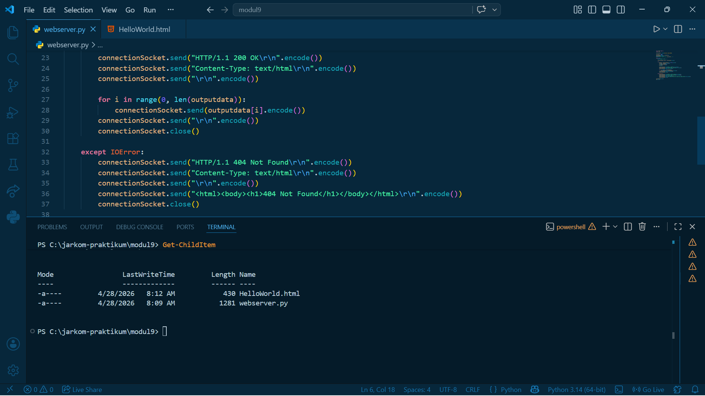
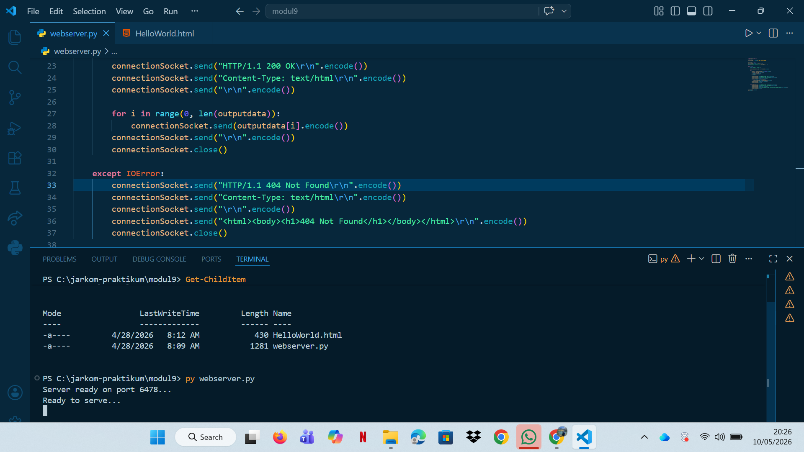
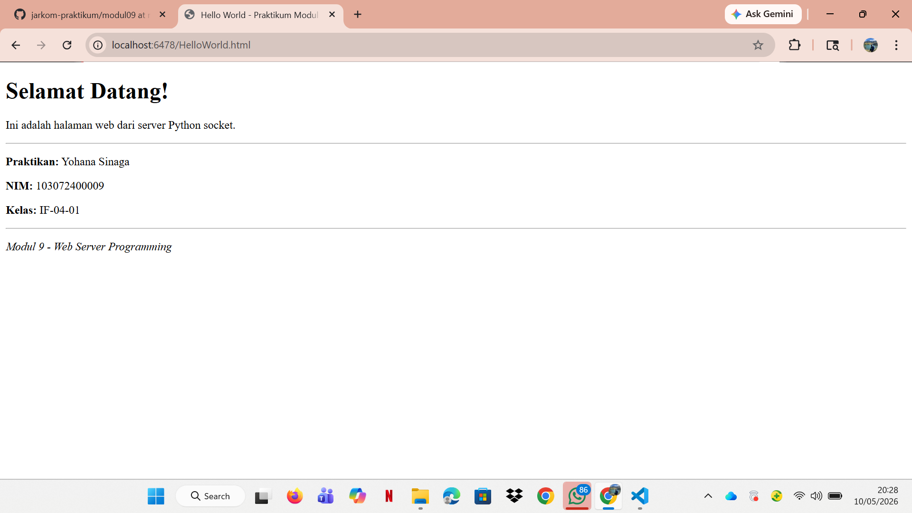
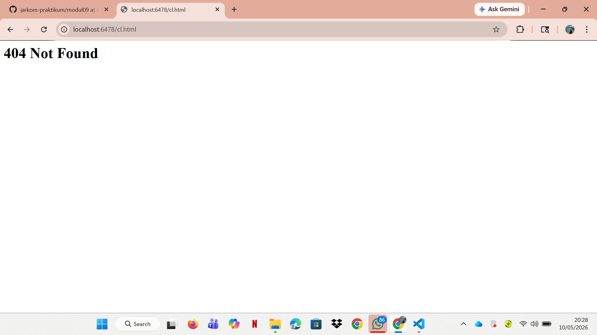

# Laporan Praktikum Jaringan Komputer - Modul 9
## Web Server Programming dengan Python Socket

### Identitas Praktikan
| Item | Keterangan |
|------|-----------|
| **Nama** | Yohana Sinaga |
| **NIM** | 103072400009 |
| **Kelas** | IF-04-01 |

---

## 9.1 Tujuan Praktikum
1. Membuat web server sederhana menggunakan TCP socket programming
2. Memahami format HTTP request dan response
3. Menangani file request dan error 404 Not Found
4. Menguji server menggunakan browser dan command line

---

## 9.2 Kode Program Web Server

**File:** `webserver.py`

```python
from socket import *
import sys

serverSocket = socket(AF_INET, SOCK_STREAM)

serverPort = 6478
serverSocket.bind(('', serverPort))
serverSocket.listen(1)
print(f"Server ready on port {serverPort}...")

while True:
    print('Ready to serve...')
    
    connectionSocket, addr = serverSocket.accept()
    
    try:
        message = connectionSocket.recv(1024).decode()
        filename = message.split()[1]
        f = open(filename[1:])
        outputdata = f.read()
        f.close()
        
        connectionSocket.send("HTTP/1.1 200 OK\r\n".encode())
        connectionSocket.send("Content-Type: text/html\r\n".encode())
        connectionSocket.send("\r\n".encode())
        
        for i in range(0, len(outputdata)):
            connectionSocket.send(outputdata[i].encode())
        connectionSocket.send("\r\n".encode())
        connectionSocket.close()
        
    except IOError:
        connectionSocket.send("HTTP/1.1 404 Not Found\r\n".encode())
        connectionSocket.send("Content-Type: text/html\r\n".encode())
        connectionSocket.send("\r\n".encode())
        connectionSocket.send("<html><body><h1>404 Not Found</h1></body></html>\r\n".encode())
        connectionSocket.close()

serverSocket.close()
sys.exit()
```

---

## 9.3 File HTML Testing

**File:** `HelloWorld.html`

```html
<!DOCTYPE html>
<html>
<head>
    <title>Hello World - Praktikum Modul 9</title>
</head>
<body>
    <h1>Selamat Datang!</h1>
    <p>Ini adalah halaman web dari server Python socket.</p>
    <hr>
    <p><strong>Praktikan:</strong> Yohana Sinaga</p>
    <p><strong>NIM:</strong> 103072400009</p>
    <p><strong>Kelas:</strong> IF-04-01</p>
    <hr>
    <p><em>Modul 9 - Web Server Programming</em></p>
</body>
</html>
```

---

## 9.4 Hasil Praktikum

### 9.4.1 Struktur Folder dan File

**Lokasi File:**
```
modul09/
├── assets/
│   ├── HelloWorld.html
│   └── WebServer.py
└── Readme.md
```

**File dalam Direktori:**


Terlihat dua file utama:
- **HelloWorld.html** (442 bytes) - File HTML yang akan di-serve
- **WebServer.py** (1443 bytes) - Program web server Python

---

### 9.4.2 Source Code Web Server

**Tampilan kode di VS Code:**



Kode program web server dengan penjelasan:
- Baris 1-2: Import library socket dan sys
- Baris 5-11: Setup server socket dan binding ke port 6789
- Baris 13-18: Looping untuk accept koneksi client
- Baris 20-24: Parse HTTP request dan baca file
- Baris 26-30: Kirim HTTP response 200 OK dengan isi file
- Baris 32-37: Handle error 404 Not Found

---

### 9.4.3 Test via Browser - Success (200 OK)

**URL:** `http://localhost:6478/HelloWorld.html`

**Hasil:**



Halaman berhasil ditampilkan dengan:
- Judul "Selamat Datang!"
- Informasi praktikan lengkap
- Status HTTP **200 OK**

---

### 9.4.4 Test via curl - File Tidak Ada

**Command:**
```powershell
curl.exe -v http://localhost:6478/NotFound.html
```

**Output:**
```
< HTTP/1.1 404 Not Found
< Content-Type: text/html
< 
<html><body><h1>404 Not Found</h1></body></html>
```



Response 404 terverifikasi via command line dengan:
- Status code: **404 Not Found**
- Content-Type: **text/html**
- Body: HTML dengan heading "404 Not Found"

---

## 9.5 Penjelasan Kode

### 9.5.1 Setup Server Socket
```python
serverSocket = socket(AF_INET, SOCK_STREAM)
serverPort = 6478
serverSocket.bind(('', serverPort))  
serverSocket.listen(1)                
print(f"Server ready on port {serverPort}...")
```
- Membuat socket TCP dengan `AF_INET` (IPv4) dan `SOCK_STREAM` (TCP)
- Bind ke port **6789** di semua network interface
- Server mulai listening untuk koneksi masuk

### 9.5.2 Accept Koneksi Client
```python
while True:
    print('Ready to serve...')
    connectionSocket, addr = serverSocket.accept()
```
- Looping tanpa batas untuk handle multiple requests
- `accept()` membuat socket khusus (`connectionSocket`) untuk client ini
- `addr` berisi tuple (IP_client, port_client)

### 9.5.3 Parse HTTP Request
```python
try:
    message = connectionSocket.recv(1024).decode()
    filename = message.split()[1]     
    f = open(filename[1:])             
    outputdata = f.read()
    f.close()
```
- Terima HTTP request (max 1024 bytes) dan decode dari bytes ke string
- Split message dan ambil elemen kedua (filename)
- Hilangkan karakter "/" pertama dengan `filename[1:]`
- Baca isi file ke variabel `outputdata`

### 9.5.4 Kirim HTTP Response (200 OK)
```python
connectionSocket.send("HTTP/1.1 200 OK\r\n".encode())
connectionSocket.send("Content-Type: text/html\r\n".encode())
connectionSocket.send("\r\n".encode())  

for i in range(0, len(outputdata)):
    connectionSocket.send(outputdata[i].encode())
connectionSocket.send("\r\n".encode())
connectionSocket.close()
```
- **Status line:** `HTTP/1.1 200 OK`
- **Header:** `Content-Type: text/html`
- **Blank line:** `\r\n` menandakan akhir headers
- **Body:** Kirim isi file character by character
- Tutup koneksi setelah selesai

### 9.5.5 Handle Error (404 Not Found)
```python
except IOError:
    connectionSocket.send("HTTP/1.1 404 Not Found\r\n".encode())
    connectionSocket.send("Content-Type: text/html\r\n".encode())
    connectionSocket.send("\r\n".encode())
    connectionSocket.send("<html><body><h1>404 Not Found</h1></body></html>\r\n".encode())
    connectionSocket.close()
```
- Jika file tidak ditemukan → throw `IOError`
- Kirim response **404 Not Found**
- Sertakan HTML sederhana dengan pesan error
- Tutup koneksi client

---

## 9.7 Kesimpulan

Berdasarkan praktikum yang telah dilakukan:

1. **Web server berhasil dibuat** dengan ~40 baris kode Python menggunakan TCP socket programming.

2. **Server berjalan di port 6478** dan dapat diakses via:
   - Browser: `http://localhost:6478/HelloWorld.html` 
   - Command line: `curl http://localhost:6478/HelloWorld.html`

3. **HTTP Response berhasil diimplementasikan:**
   - Status **200 OK** untuk file yang ada
   - Status **404 Not Found** untuk file yang tidak ada
   - Content-Type header dikirim dengan benar

4. **Format HTTP sesuai standar RFC 7230:**
   - Request: `GET /filename HTTP/1.1` + headers
   - Response: `HTTP/1.1 STATUS_CODE` + headers + blank line + body

5. **Server handling berfungsi dengan baik:**
   - `accept()` → buat socket khusus per client
   - `recv()` → baca HTTP request
   - Parse filename → buka file → kirim response
   - `close()` → tutup koneksi setelah selesai

6. **Error handling** dengan try-except berhasil menangani file tidak found (IOError).

7. **Testing komprehensif** via browser dan curl menunjukkan server berfungsi dengan baik untuk kedua skenario (file ada dan file tidak ada).

8. **Struktur folder** terorganisir dengan file HTML dan Python server di direktori yang sama.

---

## Daftar Pustaka
1. Kurose, J.F., & Ross, K.W. (2021). *Computer Networking: A Top-Down Approach*. 8th Edition. Pearson.
2. Modul Praktikum Jaringan Komputer, Universitas Telkom (2026).
3. Python Socket Documentation. https://docs.python.org/3/library/socket.html
4. RFC 7230: HTTP/1.1 Message Syntax and Routing. IETF. https://tools.ietf.org/html/rfc7230
5. MDN Web Docs: HTTP Overview. https://developer.mozilla.org/en-US/docs/Web/HTTP