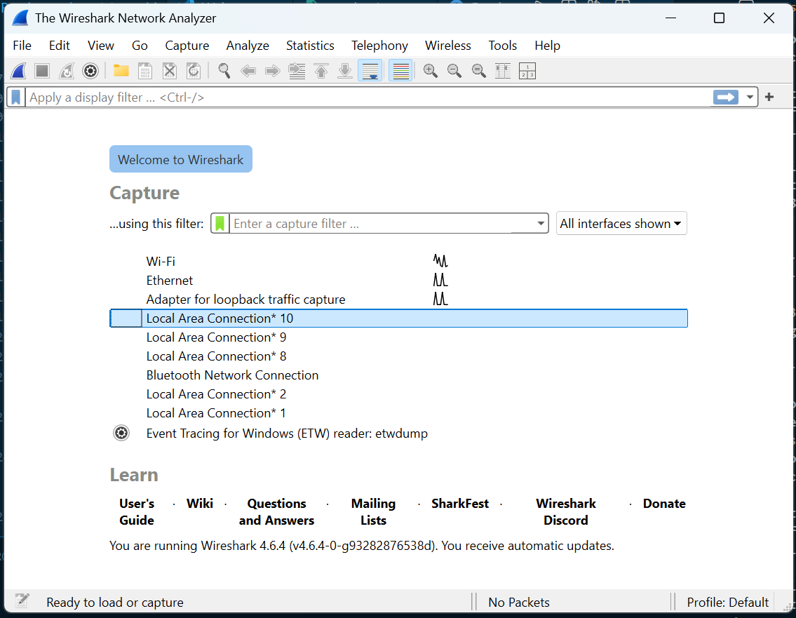
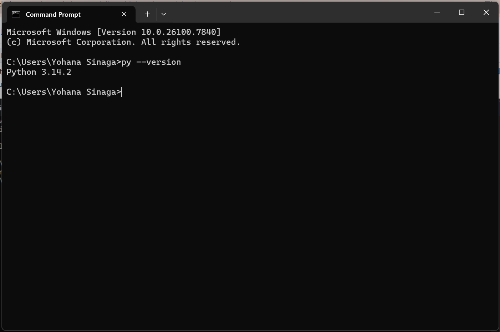

# Laporan Praktikum Jaringan Komputer - Modul 1
## Running Modul (Rules & Tools Setup)

### Identitas Praktikan
| Item | Keterangan |
|------|------------|
| **Nama** | [Yohana Sinaga] |
| **NIM** | [103072400009] |
| **Kelas** | [IF-04-01] |

---

## 1. Tujuan Praktikum
Berdasarkan modul praktikum Jaringan Komputer Semester Genap 2025/2026, tujuan dari Modul 1 adalah:
1. Mahasiswa mengetahui aturan dan sistem pelaksanaan praktikum.
2. Mahasiswa mengetahui tools yang akan digunakan dan memastikan tools berfungsi dengan baik selama pelaksanaan praktikum.

---

## 2. Persiapan Tools
Sebelum memulai praktikum, dilakukan pengecekan dan instalasi tools yang wajib digunakan selama 16 pertemuan ke depan.

### 2.1 Wireshark
Wireshark adalah aplikasi packet sniffer yang digunakan untuk menganalisis protokol jaringan.
- **Status:** Terinstall ✅
- **Versi:** `[Isi Versi Wireshark Anda, misal: 4.0.3]`
- **Link Download:** [www.wireshark.org](https://www.wireshark.org/)

### 2.2 Python
Python digunakan untuk modul Socket Programming.
- **Status:** Terinstall ✅
- **Versi:** `[Isi Versi Python Anda, misal: 3.11.0]`
- **Link Download:** [www.python.org](https://www.python.org/downloads/)

### 2.3 Tools Tambahan (Opsional)
| Tools | Kegunaan | Status |
|-------|----------|--------|
| Git | Version control | ✅/❌ |
| VS Code / Text Editor | Penulisan kode | ✅/❌ |
| Command Prompt / Terminal | Eksekusi command line | ✅ |

---

## 3. Langkah Kerja
Berikut adalah langkah-langkah yang dilakukan selama praktikum Modul 1:

### 3.1 Briefing Aturan Praktikum
- Mendengarkan penjelasan asisten mengenai tata tertib laboratorium (TULT Lantai 6 & 7).
- Memahami sistem penilaian, kehadiran (minimal 75%), dan sanksi pelanggaran.
- Memahami alur 16 modul praktikum hingga Tugas Besar.

### 3.2 Pengecekan Tools
- Memastikan Wireshark dan Python sudah terinstall di komputer laboratorium/personal.
- Melakukan update jika diperlukan.
- Verifikasi instalasi melalui command line:
  ```bash
  # Cek versi Python
  python --version
  # atau
  python3 --version
  
  # Cek Wireshark (opsional, via GUI)
  wireshark --version
  ```

### 3.3 Test Run Wireshark
1. Mengunduh file `soal1.pcap` dari LMS kelas praktikum.
2. Membuka aplikasi Wireshark.
3. Melakukan open file `soal1.pcap` melalui menu `File > Open`.
4. Mengamati fitur dasar Wireshark:
   - **Packet List**: Daftar paket yang tertangkap
   - **Packet Details**: Detail protokol per paket
   - **Packet Bytes**: Representasi hex dari paket

---


## 4. Hasil dan Pembahasan

### 4.1 Tampilan Awal Wireshark
Berikut adalah tampilan awal Wireshark sebelum membuka file trace. Terlihat daftar interface jaringan yang tersedia.

  
*Gambar 1: Tampilan awal Wireshark saat pertama kali dibuka.*


| No. | Field | Value |
|-----|-------|-------|
| 1 | Protocol | `[Contoh: HTTP/TCP/DNS]` |
| 2 | Source IP | `[Contoh: 192.168.1.10]` |
| 3 | Destination IP | `[Contoh: 172.217.194.100]` |
| 4 | Port Source | `[Contoh: 54321]` |
| 5 | Port Destination | `[Contoh: 80/443]` |

  
*Gambar 3: Detail paket pada jendela Packet Details.*

### 4.2 Verifikasi Python
Berikut adalah tangkapan layar Command Prompt/Terminal saat mengecek versi Python untuk memastikan tools siap digunakan pada modul selanjutnya (Modul 7 & 9).

```bash
$ python --version
Python 3.14.2
```

  
*Gambar 4: Verifikasi instalasi Python melalui command line.*

---

## 4.3. Kesimpulan
Berdasarkan praktikum Modul 1 ini, dapat disimpulkan bahwa:
1. Praktikan telah memahami aturan main, sistem penilaian, dan sanksi yang berlaku di Laboratorium Informatika Universitas Telkom.
2. Tools utama yaitu **Wireshark** dan **Python** telah berhasil diinstall dan berfungsi dengan baik.
3. Praktikan mampu membuka file trace (`.pcap`) dan memahami antarmuka dasar Wireshark yang akan digunakan pada modul-modul selanjutnya (HTTP, DNS, TCP, dll).
4. Kesiapan tools ini sangat penting untuk kelancaran praktikum hingga penyusunan Tugas Besar.

---

## 📝 Catatan Pengisian
> **PENTING:** Ganti semua teks dalam `[tanda kurung siku]` dengan data sesuai kondisi Anda. Pastikan path gambar sesuai dengan struktur folder repository Anda.

### Struktur Folder yang Disarankan
```
modul-1/
├── README.md
├── assets/
│   ├── wireshark_home.png
│   └── python_version.png
├── images/
│   ├── wireshark_soal1.png
│   └── wireshark_detail.png
└── files/
    └── soal1.pcap (opsional)
```

---

> **Dibuat oleh:** [Yohana Sinaga]   
> **Mata Kuliah:** Jaringan Komputer - Modul 1  
> **Institusi:** Universitas Telkom  

*Document Version: 1.0* ✅