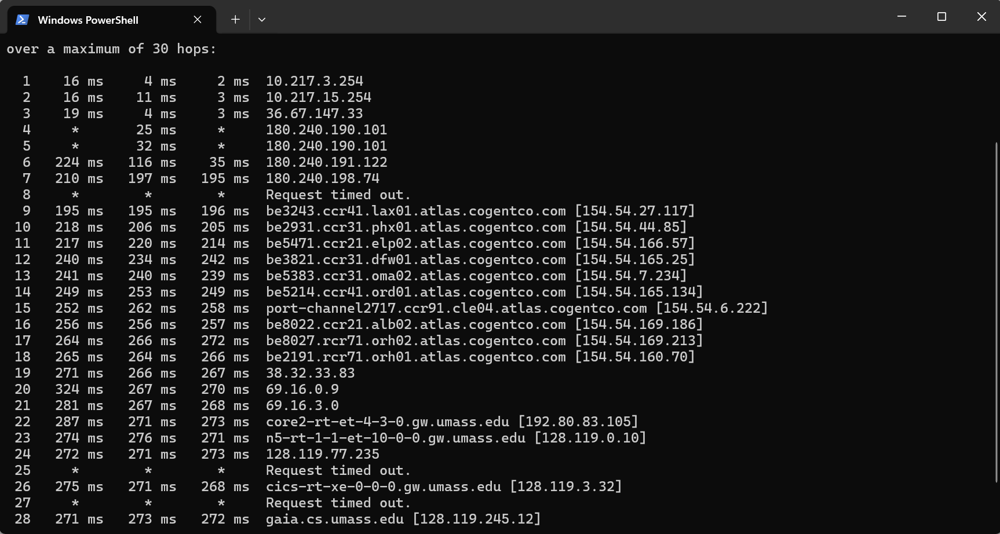
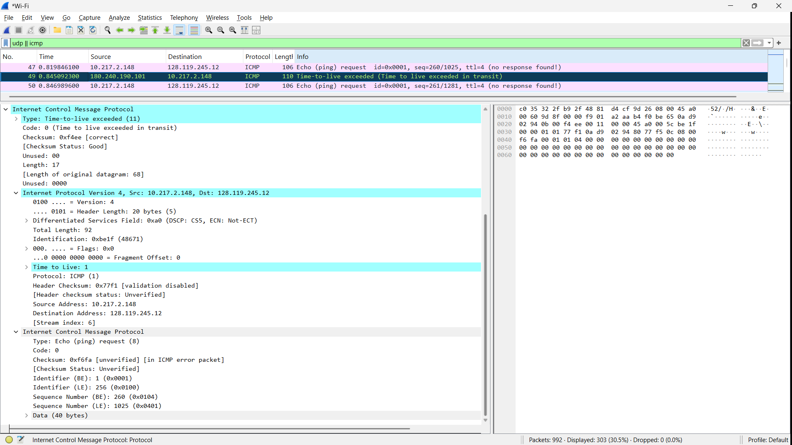
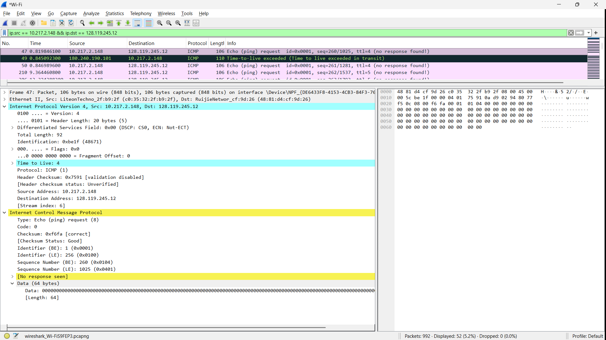
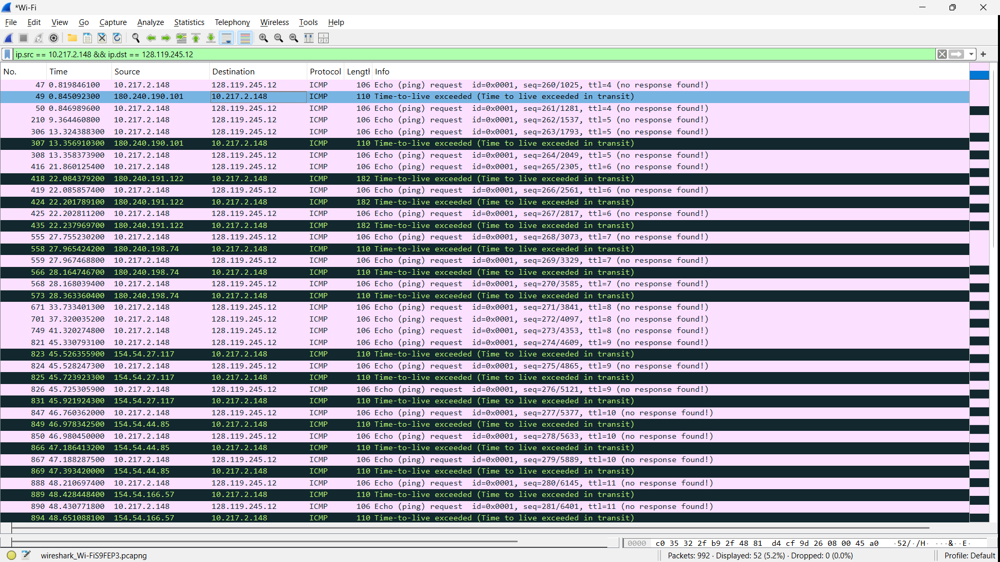
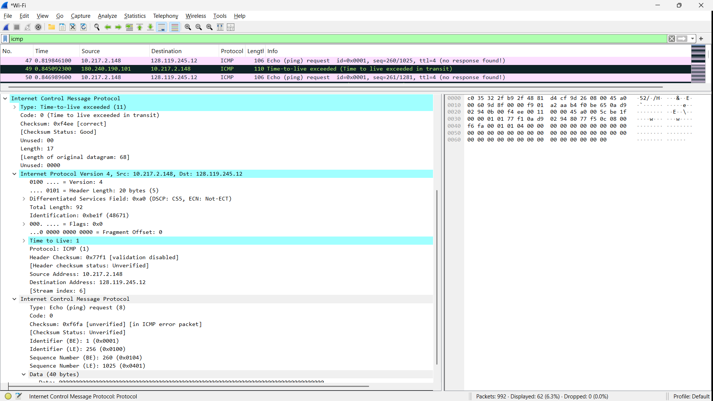

# Laporan Praktikum Jaringan Komputer - Modul 10
## Internet Protocol (IP) Analysis

### Identitas Praktikan
| Item | Keterangan |
|------|-----------|
| **Nama** | Yohana Sinaga |
| **NIM** | 103072400009 |
| **Kelas** | IF-04-01 |

---

## 10.1 Tujuan Praktikum
1. Menganalisis cara kerja protokol IP menggunakan Wireshark
2. Memahami struktur header IPv4 dan field-field penting
3. Mempelajari fragmentasi IP pada datagram besar
4. Mengenal datagram IPv6

---

## 10.2 Langkah Praktikum

### 10.2.1 Capture Paket Traceroute

**Langkah-langkah:**

1. **Start Wireshark capture**
   - Buka Wireshark dan pilih interface aktif (Wi-Fi)
   - Klik tombol Start Capture

2. **Jalankan traceroute**
   ```cmd
   # Windows (PowerShell / CMD)
   tracert gaia.cs.umass.edu
   ```

3. **Stop capture setelah traceroute selesai**

4. **Filter paket di Wireshark:**
   ```
   icmp
   ```

---

## 10.3 Hasil Praktikum

### 10.3.1 Bagian 1: Analisis IPv4 Dasar

**Filter Wireshark yang Digunakan:**
```
ip.src == 10.217.2.148 && ip.dst == 128.119.245.12
```

**Hasil traceroute:**



*Gambar 1: Paket ICMP dari traceroute ke gaia.cs.umass.edu (128.119.245.12)*

**Analisis Paket ICMP dari Traceroute:**

Dari screenshot di atas, terlihat paket-paket ICMP dengan berbagai TTL:

| No | Frame | Source | Destination | TTL | Info |
|----|-------|--------|-------------|-----|------|
| 1 | 47 | 10.217.2.148 | 128.119.245.12 | 4 | Echo (ping) request |
| 2 | 49 | 180.240.190.101 | 10.217.2.148 | - | Time-to-live exceeded |
| 3 | 210 | 10.217.2.148 | 128.119.245.12 | 5 | Echo (ping) request |
| 4 | 307 | 180.240.191.122 | 10.217.2.148 | - | Time-to-live exceeded |
| 5 | 416 | 10.217.2.148 | 128.119.245.12 | 6 | Echo (ping) request |
| 6 | 418 | 180.240.198.74 | 10.217.2.148 | - | Time-to-live exceeded |

**Penjelasan:**
- **Paket ungu/merah muda**: ICMP Echo Request dari client dengan TTL increasing (4, 5, 6, ...)
- **Paket hijau/biru**: ICMP Time-to-live exceeded dari router intermediate
- Router dengan IP **180.240.190.101**, **180.240.191.122**, **180.240.198.74** mengirim ICMP Type 11

---

### 10.3.2 Detail Header IPv4 dan ICMP

**Paket ICMP Time-to-Live Exceeded:**



*Gambar 2: Detail paket ICMP Type 11 (Time-to-live exceeded) Code 0*

**Struktur ICMP TTL-Exceeded:**

```
Internet Control Message Protocol
    Type: 11 (Time-to-live exceeded)
    Code: 0 (Time to live exceeded in transit)
    Checksum: 0xf4ff [correct]
    [Checksum Status: Good]
    Unused: 00000000
```

**Analisis:**
- **Type 11** = Time-to-live exceeded
- **Code 0** = TTL expired in transit
- Dikirim oleh router **180.240.190.101** kembali ke **10.217.2.148**
- Router mengurangi TTL paket asli menjadi 0, lalu mengirim pesan error ini

**Original Datagram (dalam ICMP error):**
```
Internet Protocol Version 4, Src: 10.217.2.148, Dst: 128.119.245.12
    Time to Live: 1
    Protocol: ICMP (1)
```
Terlihat TTL asli = 1, yang sudah expire tepat di router ini.

---

### 10.3.3 Analisis ICMP Echo Request (Ping)

**Detail Frame - ICMP Echo Request:**



*Gambar 3: Detail ICMP Echo Request dengan TTL=4*

**Header IPv4:**

```
Internet Protocol Version 4, Src: 10.217.2.148, Dst: 128.119.245.12
    0100 .... = Version: 4
    .... 0101 = Header Length: 20 bytes (5)
    Differentiated Services Field: 0x00 (DSCP: CS0, ECN: Not-ECT)
    Total Length: 92
    Identification: 0xXXXX (varies per packet)
    Flags: 0x00
    .... ...0 0000 0000 0000 000 = Fragment Offset: 0
    Time to Live: 4
    Protocol: ICMP (1)
    Header Checksum: 0xXXXX [validation disabled]
    Source Address: 10.217.2.148
    Destination Address: 128.119.245.12
```

**Header ICMP:**

```
Internet Control Message Protocol
    Type: 8 (Echo (ping) request)
    Code: 0
    Checksum: 0xXXXX [correct]
    Identifier (BE): 1 (0x0001)
    Identifier (LE): 256 (0x0100)
    Sequence Number (BE): XX (0x00XX)
    Sequence Number (LE): XXXX (0xXX00)
    Data (64 bytes)
```

**Field Penting Header IPv4:**

| Field | Nilai | Fungsi |
|-------|-------|--------|
| **Version** | 4 | IPv4 |
| **Header Length** | 20 bytes | Panjang header minimal |
| **Total Length** | 92 bytes | Total ukuran paket |
| **Identification** | Unik per paket | ID untuk reassembly fragment |
| **Flags** | 0x00 | Tidak ada fragmentasi |
| **Fragment Offset** | 0 | Bukan fragment |
| **Time to Live (TTL)** | 4,5,6,... | Akan expire setelah N hop |
| **Protocol** | ICMP (1) | Protokol lapisan atas |
| **Source IP** | 10.217.2.148 | IP komputer praktikan |
| **Destination IP** | 128.119.245.12 | gaia.cs.umass.edu |

---

### 10.3.4 Analisis TTL (Time to Live)

**Cara Kerja TTL pada Traceroute:**



*Gambar 4: Paket dengan TTL berbeda (4, 5, 6, 7, 8, 9, 10, 11) menunjukkan mekanisme traceroute*

**Penjelasan:**

| TTL | Hop yang Dicapai | Response Router |
|-----|------------------|-----------------|
| 1 | Router 1 (10.217.x.x) | ICMP TTL-exceeded |
| 2 | Router 2 (10.217.x.x) | ICMP TTL-exceeded |
| 3 | Router 3 (10.217.x.x) | ICMP TTL-exceeded |
| 4 | Router 4 (180.240.190.101) | ICMP TTL-exceeded |
| 5 | Router 5 (180.240.190.101) | ICMP TTL-exceeded |
| 6 | Router 6 (180.240.191.122) | ICMP TTL-exceeded |
| 7 | Router 7 (180.240.198.74) | ICMP TTL-exceeded |
| 8+ | Cogent/UMass Network | ICMP TTL-exceeded / Reply |

**Dari Screenshot Wireshark:**
- Terlihat paket dengan **TTL = 4, 5, 6, 7, 8, 9, 10, 11**
- Router **180.240.190.101** merespon untuk TTL 4 & 5
- Router **180.240.191.122** merespon untuk TTL 6
- Router **180.240.198.74** merespon untuk TTL 7
- Selanjutnya masuk jaringan **Cogent** (`154.54.x.x`) dan **UMass** (`gw.umass.edu`)

Terlihat TTL meningkat secara bertahap, sesuai cara kerja traceroute.

---

### 10.3.5 Filter dan Analisis Paket

**Filter yang Digunakan:**

1. **Tampilkan semua ICMP:**
   ```
   icmp
   ```

2. **Tampilkan ICMP ke komputer lokal:**
   ```
   icmp && ip.dst == 10.217.2.148
   ```

3. **Tampilkan paket ke tujuan:**
   ```
   ip.src == 10.217.2.148 && ip.dst == 128.119.245.12
   ```

**Hasil Filter:**



*Gambar 5: Hasil filter ICMP packets di Wireshark*

---

### 10.3.6 Bagian 2: Fragmentasi IP

**Catatan Penting:**

Pada capture ini, **tidak terlihat fragmentasi** karena:

1. **Ukuran paket kecil**: Total Length = 92 bytes
2. **MTU jaringan Ethernet** = 1500 bytes
3. **92 < 1500** → **tidak perlu fragmentasi**

**Flags di Header IPv4 (dari screenshot):**
```
Flags: 0x00
    0... .... = Reserved bit: Not set
    .0.. .... = Don't fragment: Not set
    ..0. .... = More fragments: Not set
    ...0 0000 0000 0000 000 = Fragment Offset: 0
```

Terlihat **MF (More Fragments) = 0** dan **Fragment Offset = 0**, konfirmasi bahwa paket tidak terfragmentasi.

---

### 10.3.7 Bagian 3: IPv6 Overview

**Catatan:** 

Capture yang dilakukan masih menggunakan **IPv4** karena:
- Jaringan yang digunakan (Wi-Fi lokal) masih IPv4
- Windows tracert default menggunakan IPv4
- Target gaia.cs.umass.edu resolve ke IPv4 address (128.119.245.12)

---

## 10.4 Analisis Praktikum

### 10.4.1 Mekanisme Traceroute

**Berdasarkan hasil capture:**

**Alur Traceroute:**

1. **Client mengirim ICMP Echo Request** dengan TTL=4
   ```
   Src: 10.217.2.148 → Dst: 128.119.245.12
   TTL: 4
   ```

2. **Router 180.240.190.101** mengurangi TTL menjadi 0
   - TTL = 0 → paket dibuang
   - Router kirim **ICMP Type 11** (TTL-exceeded) ke client

3. **Client mengirim ICMP Echo Request** dengan TTL=5, 6, 7, ...

4. **Proses berlanjut** hingga paket mencapai tujuan

5. **Destination** (128.119.245.12) mengirim ICMP Echo Reply (Type 0)

**Dari Data Capture (Ringkasan Hop):**

| Hop | Router IP / Domain | Keterangan |
|-----|-------------------|------------|
| 1-3 | 10.217.x.x | Jaringan lokal / ISP lokal |
| 4-5 | 180.240.190.101 | Router ISP (Indonesian Internet Exchange) |
| 6 | 180.240.191.122 | Router transit |
| 7 | 180.240.198.74 | Router transit |
| 9-21 | *.cogentco.com | Jaringan Cogent Communications (backbone internasional) |
| 22-23 | *.gw.umass.edu | Jaringan University of Massachusetts |
| Final | 128.119.245.12 | gaia.cs.umass.edu (tujuan) |

---

### 10.4.2 ICMP Message Types

**Yang terlihat di capture:**

| Type | Code | Message | Keterangan |
|------|------|---------|------------|
| **8** | 0 | Echo (ping) request | Dari client ke server |
| **11** | 0 | Time-to-live exceeded | Dari router saat TTL=0 |

**Penjelasan:**

1. **Type 8 - Echo Request:**
   - Dikirim oleh `tracert` Windows
   - Berisi data 64 bytes
   - Identifier: 0x0001
   - Sequence Number: increasing

2. **Type 11 - TTL Exceeded:**
   - Dikirim oleh router intermediate (misal: 180.240.190.101)
   - Ketika TTL mencapai 0
   - Berisi original datagram dalam payload untuk debugging

---

### 10.4.3 Field-Field Penting IPv4

**Yang dianalisis dari capture:**

**1. TTL (Time to Live):**
```
Ukuran: 8 bit (0-255)
Fungsi: Mencegah paket berputar selamanya
Setiap router mengurangi TTL minimal 1
Jika TTL = 0 → paket dibuang + kirim ICMP Type 11
```

**Dari capture:**
- TTL bervariasi: 4, 5, 6, 7, 8, 9, 10, 11...
- Traceroute dengan sengaja set TTL increasing untuk memetakan rute

**2. Protocol:**
```
ICMP = 1
TCP = 6
UDP = 17
```

**Dari capture:**
- Protokol = ICMP (1) untuk Echo Request dan TTL-exceeded

**3. Total Length:**
```
Ukuran: 16 bit (max 65535 bytes)
Header + Data
```

**Dari capture:**
- Total Length = 92 bytes (Echo Request default Windows)

**4. Identification:**
```
Unik untuk setiap datagram
Digunakan untuk reassembly fragment
```

**5. Flags:**
```
Bit 0: Reserved (must be 0)
Bit 1: DF (Don't Fragment)
Bit 2: MF (More Fragments)
```

**Dari capture:**
```
Flags: 0x00 → Tidak ada fragmentasi
```

---

## 10.5 Kesimpulan

Berdasarkan praktikum yang telah dilakukan:

### **1. Protokol IP berhasil dianalisis**
Menggunakan Wireshark dengan capture paket traceroute (tracert) ke gaia.cs.umass.edu (128.119.245.12)

### **2. Header IPv4 memiliki field-field penting:**
Field yang berhasil dianalisis:
- **Version**: 4 (IPv4)
- **Header Length**: 20 bytes
- **Total Length**: 92 bytes (pada capture)
- **TTL (Time to Live)**: Bervariasi (4, 5, 6, 7, 8, 9, 10, 11...)
- **Protocol**: ICMP (1)
- **Identification**: Unik per paket
- **Flags**: 0x00 (tidak ada fragmentasi)
- **Source IP**: 10.217.2.148
- **Destination IP**: 128.119.245.12

### **3. Traceroute bekerja dengan memanfaatkan TTL:**
Mekanisme yang teramati:
- Kirim paket dengan **TTL increasing**
- Router mengurangi TTL dan kirim **ICMP Type 11** (TTL-exceeded) saat TTL=0
- Client mengidentifikasi router dari **Source IP** paket ICMP
- Dari capture terlihat rute: lokal → ISP (180.240.x.x) → Cogent → UMass

### **4. ICMP messages berhasil dianalisis:**
Type yang teramati:
- **Type 8, Code 0**: Echo (ping) request
- **Type 11, Code 0**: Time-to-live exceeded

### **5. Fragmentasi IP tidak teramati:**
Alasan:
- Ukuran paket kecil (**92 bytes < MTU 1500 bytes**)
- Windows tracert tidak support set ukuran paket besar
- Flags **MF=0** dan **Fragment Offset=0** konfirmasi tidak ada fragmentasi

### **6. IPv6 tidak teramati:**
Alasan:
- Jaringan yang digunakan masih IPv4
- Windows tracert default ke IPv4

### **7. Wireshark efektif untuk analisis:**
Fitur yang digunakan:
- Filter `icmp` menampilkan semua paket ICMP
- Filter `icmp && ip.dst == 10.217.2.148` fokus pada response
- Filter `ip.src == 10.217.2.148 && ip.dst == 128.119.245.12` untuk request
- Detail header dapat di-expand dan dianalisis field per field

---

## Daftar Pustaka

1. Kurose, J.F., & Ross, K.W. (2021). *Computer Networking: A Top-Down Approach*. 8th Edition. Pearson.

2. Universitas Telkom. (2026). *Modul Praktikum Jaringan Komputer Semester Genap 2025/2026*. Modul 10: Internet Protocol (IP) Analysis.

3. Postel, J. (1981). *RFC 792: Internet Control Message Protocol*. IETF. https://tools.ietf.org/html/rfc792

4. Rekhter, Y., et al. (1995). *RFC 1812: Requirements for IP Version 4 Routers*. IETF. https://tools.ietf.org/html/rfc1812

5. Wireshark Foundation. (2024). *Wireshark User's Guide*. https://www.wireshark.org/docs/

---
