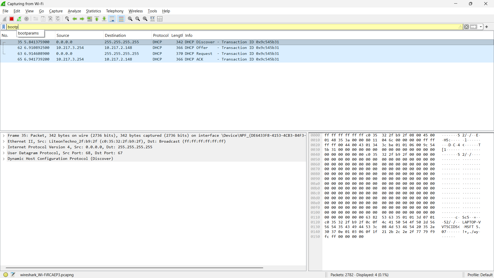
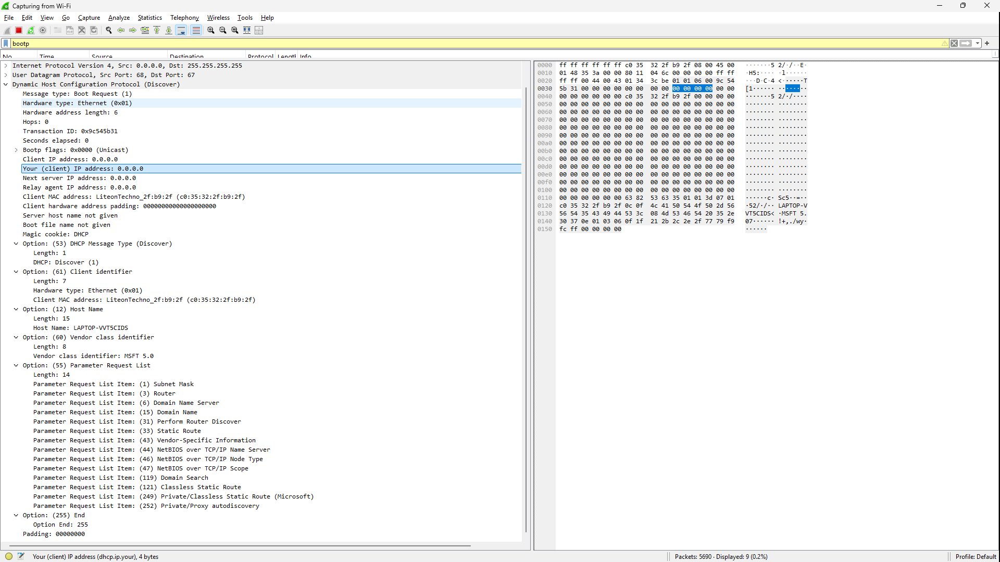
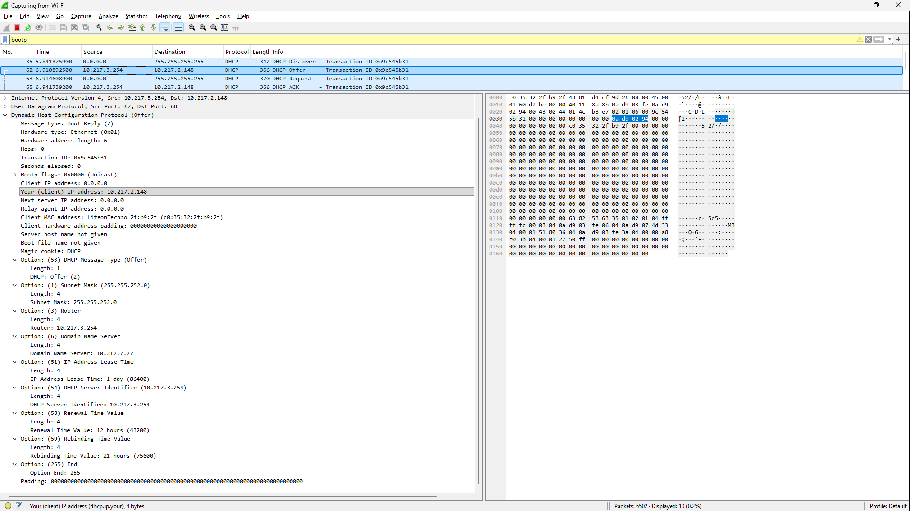
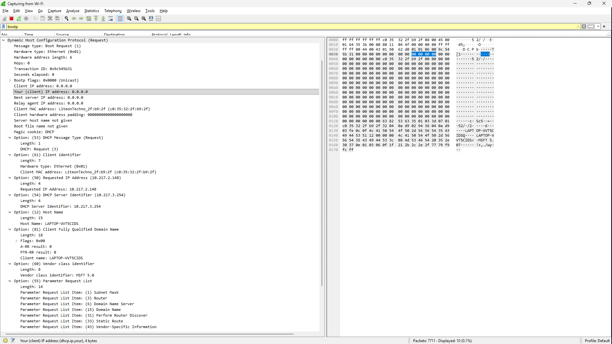
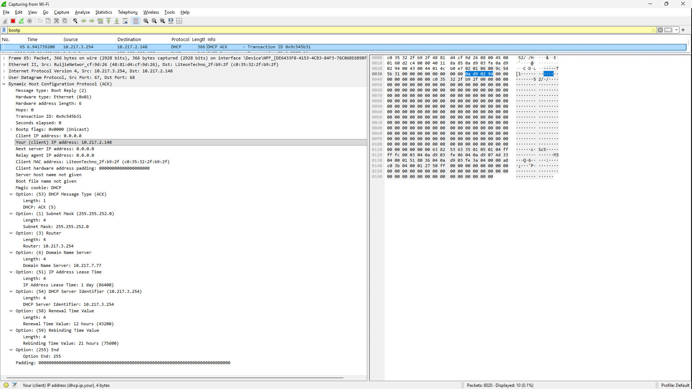

# Laporan Praktikum Jaringan Komputer - Modul 11
## Dynamic Host Configuration Protocol (DHCP)

### Identitas Praktikan
| Item | Keterangan |
|------|-----------|
| **Nama** | Yohana Sinaga |
| **NIM** | 103072400009 |
| **Kelas** | IF-04-01 |

---

## 11.1 Tujuan Praktikum
1. Menangkap dan menganalisis paket DHCP menggunakan Wireshark
2. Memahami proses DORA (Discover-Offer-Request-ACK)
3. Melihat konfigurasi jaringan yang diberikan DHCP server

---

## 11.2 Langkah Praktikum

**Yang dilakukan:**
1. Buka Command Prompt
2. Jalankan `ipconfig /release` (lepaskan IP)
3. Start Wireshark capture (pilih interface Wi-Fi)
4. Jalankan `ipconfig /renew` (minta IP baru)
5. Stop capture setelah IP muncul
6. Filter paket dengan `bootp`

---

## 11.3 Hasil Praktikum

### 11.3.1 Paket DHCP yang Berhasil Ditangkap

**Filter:** `bootp`



**Tabel Paket DHCP:**

| Frame | Waktu | Message Type | Source | Destination | Transaction ID |
|-------|-------|--------------|--------|-------------|----------------|
| 35 | 5.841s | DHCP Discover | 0.0.0.0 | 255.255.255.255 | 0x9c545b31 |
| 62 | 6.910s | DHCP Offer | 10.217.3.254 | 10.217.2.148 | 0x9c545b31 |
| 63 | 6.914s | DHCP Request | 0.0.0.0 | 255.255.255.255 | 0x9c545b31 |
| 65 | 6.941s | DHCP ACK | 10.217.3.254 | 10.217.2.148 | 0x9c545b31 |

**Catatan:**
- Keempat paket memiliki Transaction ID **0x9c545b31** yang sama → satu sesi DHCP DORA lengkap
- Proses DORA berlangsung dari detik ke-5.841 hingga 6.941 (~1.1 detik)

---

### 11.3.2 DHCP Discover (Frame 35)



**Detail Paket:**
```
Message type: Boot Request (1) - Discover
Transaction ID: 0x9c545b31
Client MAC address: LiteonTechno_2f:b9:2f (c0:35:32:2f:b9:2f)
Client IP address: 0.0.0.0 (belum punya IP)

Options:
  (53) DHCP Message Type: Discover (1)
  (61) Client identifier
    - Hardware type: Ethernet (0x01)
    - Client MAC address: LiteonTechno_2f:b9:2f
  (12) Host Name: LAPTOP-VVT5CIDS
  (60) Vendor class identifier: MSFT 5.0
  (55) Parameter Request List:
    - Subnet Mask (1)
    - Router (3)
    - Domain Name Server (6)
    - Domain Name (15)
    - Perform Router Discover (31)
    - Static Route (33)
    - Vendor-Specific Information (43)
    - NetBIOS over TCP/IP Name Server (44)
    - NetBIOS over TCP/IP Node Type (46)
    - NetBIOS over TCP/IP Scope (47)
    - Domain Search (119)
    - Classless Static Route (121)
    - Private/Classless Static Route (Microsoft) (249)
    - Private/Proxy autodiscovery (252)
```

**Yang terjadi:**
- Client broadcast cari DHCP server
- Client belum punya IP (0.0.0.0)
- Hostname: **LAPTOP-VVT5CIDS**
- Vendor: **MSFT 5.0** (Windows)
- Request 14 parameter konfigurasi: subnet mask, router, DNS, dll

---

### 11.3.3 DHCP Offer (Frame 62)



**Detail Paket:**
```
Message type: Boot Reply (2) - Offer
Transaction ID: 0x9c545b31 (SAMA dengan Discover!)
Your (client) IP address: 10.217.2.148
Next server IP address: 0.0.0.0
Client MAC address: LiteonTechno_2f:b9:2f (c0:35:32:2f:b9:2f)

Options:
  (53) DHCP Message Type: Offer (2)
  (1) Subnet Mask: 255.255.252.0
  (3) Router: 10.217.3.254
  (6) Domain Name Server: 10.217.7.77
  (51) IP Address Lease Time: 1 day (86400)
  (54) DHCP Server Identifier: 10.217.3.254
  (58) Renewal Time Value: 12 hours (43200)
  (59) Rebinding Time Value: 21 hours (75600)
```

**Yang ditawarkan server:**
- **IP Address:** 10.217.2.148
- **Subnet Mask:** 255.255.252.0 (network /22)
- **Router/Gateway:** 10.217.3.254
- **DNS Server:** 10.217.7.77
- **Lease Time:** 1 hari (86400 detik)
- **Renewal Time:** 12 jam (50% dari lease time)
- **Rebinding Time:** 21 jam (87.5% dari lease time)

---

### 11.3.4 DHCP Request (Frame 63)



**Detail Paket:**
```
Message type: Boot Request (1) - Request
Transaction ID: 0x9c545b31
Client MAC address: LiteonTechno_2f:b9:2f (c0:35:32:2f:b9:2f)
Client IP address: 0.0.0.0

Options:
  (53) DHCP Message Type: Request (3)
  (50) Requested IP Address: 10.217.2.148
  (54) DHCP Server Identifier: 10.217.3.254
  (12) Host Name: LAPTOP-VVT5CIDS
  (81) Client Fully Qualified Domain Name
    - Client name: LAPTOP-VVT5CIDS
  (60) Vendor class identifier: MSFT 5.0
  (55) Parameter Request List:
    - Subnet Mask, Router, DNS, Domain Name, dll
```

**Yang dilakukan client:**
- Menerima tawaran server
- Request IP **10.217.2.148** secara formal
- Pilih server **10.217.3.254**
- Broadcast ke seluruh jaringan

---

### 11.3.5 DHCP ACK (Frame 65)



**Detail Paket:**
```
Message type: Boot Reply (2) - ACK
Transaction ID: 0x9c545b31
Your (client) IP address: 10.217.2.148
Next server IP address: 0.0.0.0
Client MAC address: LiteonTechno_2f:b9:2f

Options:
  (53) DHCP Message Type: ACK (5)
  (1) Subnet Mask: 255.255.252.0
  (3) Router: 10.217.3.254
  (6) Domain Name Server: 10.217.7.77
  (51) IP Address Lease Time: 1 day (86400)
  (54) DHCP Server Identifier: 10.217.3.254
  (58) Renewal Time Value: 12 hours (43200)
  (59) Rebinding Time Value: 21 hours (75600)
```

**Konfirmasi server:**
- **IP final:** 10.217.2.148
- **Lease time:** 1 hari (86400 detik)
- **Gateway:** 10.217.3.254
- **DNS:** 10.217.7.77
- **Renewal:** Setelah 12 jam
- **Rebinding:** Setelah 21 jam

**Catatan:**
- Lease time di Offer dan ACK **SAMA** (1 hari)
- Konfigurasi konsisten antara Offer dan ACK

---

## 11.4 Analisis Praktikum

### 11.4.1 Proses DORA yang Teramati

```
Waktu 5.841s  : Client kirim DHCP Discover (broadcast)
Waktu 6.910s  : Server balas DHCP Offer (unicast ke 10.217.2.148)
Waktu 6.914s  : Client kirim DHCP Request (broadcast)
Waktu 6.941s  : Server kirim DHCP ACK (unicast ke 10.217.2.148)
────────────────────────────────────────────────────────────────
Total waktu   : ~1.1 detik (dari Discover ke ACK)
```

**Kecepatan proses:**
- Discover → Offer: 1.069 detik
- Offer → Request: 0.004 detik (sangat cepat!)
- Request → ACK: 0.027 detik
- **Total DORA:** 1.1 detik (efisien)

---

### 11.4.2 Konfigurasi Jaringan yang Diberikan

| Parameter | Nilai | Keterangan |
|-----------|-------|------------|
| **IP Address** | 10.217.2.148 | Alamat client |
| **Subnet Mask** | 255.255.252.0 | Network /22 |
| **Default Gateway** | 10.217.3.254 | Router untuk internet |
| **DNS Server** | 10.217.7.77 | DNS resolver |
| **Lease Time** | 1 hari (86400s) | Masa berlaku IP |
| **Renewal Time (T1)** | 12 jam (43200s) | Waktu renew (50%) |
| **Rebinding Time (T2)** | 21 jam (75600s) | Waktu rebinding (87.5%) |
| **DHCP Server** | 10.217.3.254 | Server yang memberi IP |

**Network Information:**
- Network: 10.217.0.0/22
- Usable IPs: 10.217.0.1 - 10.217.3.254
- Broadcast: 10.217.3.255
- Gateway dan server DHCP berbeda IP

---

### 11.4.3 Transaction ID Analysis

**Satu Sesi DORA Lengkap:**
```
Frame 35  (Discover): Transaction ID = 0x9c545b31
Frame 62  (Offer)   : Transaction ID = 0x9c545b31 ✓
Frame 63  (Request) : Transaction ID = 0x9c545b31 ✓
Frame 65  (ACK)     : Transaction ID = 0x9c545b31 ✓
```

**Kesimpulan:**
- Semua paket dalam satu sesi DORA memiliki Transaction ID yang sama
- Transaction ID: **0x9c545b31** (random yang di-generate client)
- Ini memastikan server dan client tahu paket-paket mana yang saling terkait

---

### 11.4.4 Broadcast vs Unicast

**Dari Capture Wireshark:**

**DHCP Discover (Broadcast):**
```
Source: 0.0.0.0 → Destination: 255.255.255.255
Client belum punya IP, jadi broadcast ke semua host
```

**DHCP Offer (Unicast):**
```
Source: 10.217.3.254 → Destination: 10.217.2.148
Server mengirim langsung ke client (meski client belum aktifkan IP)
```

**DHCP Request (Broadcast):**
```
Source: 0.0.0.0 → Destination: 255.255.255.255
Client broadcast untuk memberitahu semua server DHCP
(bisa jadi ada multiple server, client pilih satu)
```

**DHCP ACK (Unicast):**
```
Source: 10.217.3.254 → Destination: 10.217.2.148
Server konfirmasi langsung ke client
```

**Mengapa berbeda?**
- **Discover & Request:** Broadcast karena client belum punya IP resmi
- **Offer & ACK:** Unicast dari server ke IP yang ditawarkan

---

### 11.4.5 Lease Time Analysis

**Dari Wireshark (Offer dan ACK SAMA):**
```
IP Address Lease Time: 86400 seconds (1 day)
Renewal Time (T1): 43200 seconds (12 hours) → 50% dari lease time
Rebinding Time (T2): 75600 seconds (21 hours) → 87.5% dari lease time
```

**Timeline Lease:**
```
Waktu 0       : Client dapat IP (10.217.2.148)
Waktu 12 jam  : T1 timer → Client coba renew (unicast ke server)
Waktu 21 jam  : T2 timer → Jika renew gagal, broadcast cari server lain
Waktu 24 jam  : Lease expired → IP harus dikembalikan
```

**Implikasi:**
- Client akan otomatis renew setelah 12 jam (setengah hari)
- Jika server tidak respon, client akan broadcast setelah 21 jam
- Jika tetap tidak ada respon setelah 24 jam, IP hangus dan client harus DORA ulang

---

### 11.4.6 Client Information

**Dari Paket DHCP:**
```
Host Name: LAPTOP-VVT5CIDS
MAC Address: c0:35:32:2f:b9:2f (LiteonTechno_2f:b9:2f)
Vendor Class: MSFT 5.0 (Windows)
Hardware Type: Ethernet (0x01)
```

**Identitas Client:**
- Laptop Windows dengan nama **LAPTOP-VVT5CIDS**
- Menggunakan network adapter **Liteon Technology**
- MAC address: **c0:35:32:2f:b9:2f**

---

### 11.4.7 Parameter yang Diminta Client

**Dari Option 55 (Parameter Request List):**

Client meminta 14 parameter konfigurasi:
1. **(1) Subnet Mask** - Untuk tahu network range
2. **(3) Router** - Default gateway
3. **(6) Domain Name Server** - DNS resolver
4. **(15) Domain Name** - Domain lokal
5. **(31) Perform Router Discover** - Router discovery
6. **(33) Static Route** - Route statis
7. **(43) Vendor-Specific Information** - Info vendor
8. **(44) NetBIOS over TCP/IP Name Server** - WINS server
9. **(46) NetBIOS over TCP/IP Node Type** - NetBIOS mode
10. **(47) NetBIOS over TCP/IP Scope** - NetBIOS scope
11. **(119) Domain Search** - Search domain
12. **(121) Classless Static Route** - Route tanpa class
13. **(249) Private/Classless Static Route (Microsoft)** - MS route
14. **(252) Private/Proxy autodiscovery** - WPAD

**Yang diberikan server:**
- Subnet Mask ✓
- Router ✓
- DNS Server ✓
- Lease Time ✓

---

## 11.5 Kesimpulan

**Yang berhasil dilakukan:**

1. **Berhasil capture 4 paket DHCP lengkap** (Discover, Offer, Request, ACK) dengan Transaction ID yang sama (0x9c545b31)

2. **Proses DORA berjalan sukses:**
   - **Discover:** Client LAPTOP-VVT5CIDS broadcast cari server
   - **Offer:** Server 10.217.3.254 tawarkan IP 10.217.2.148
   - **Request:** Client minta IP tersebut secara formal
   - **ACK:** Server konfirmasi, client resmi dapat IP

3. **Waktu proses efisien:**
   - Total DORA: **~1.1 detik**
   - Offer → Request: **0.004 detik** (sangat cepat)

4. **Konfigurasi jaringan berhasil didapatkan:**
   - **IP Address:** 10.217.2.148
   - **Subnet Mask:** 255.255.252.0 (/22)
   - **Default Gateway:** 10.217.3.254
   - **DNS Server:** 10.217.7.77
   - **Lease Time:** 1 hari (24 jam)
   - **Renewal Time:** 12 jam
   - **Rebinding Time:** 21 jam

5. **Pola broadcast dan unicast teramati:**
   - Discover & Request: **Broadcast** (client belum punya IP)
   - Offer & ACK: **Unicast** (server kirim ke IP yang ditawarkan)

6. **Lease time konsisten:**
   - Offer dan ACK memiliki lease time yang **SAMA** (1 hari)
   - Server memberikan T1 (50%) dan T2 (87.5%) timer yang standar

7. **Wireshark efektif** untuk analisis DHCP dengan filter `bootp`

**Temuan penting:**
- Transaction ID **0x9c545b31** mengikat keempat paket dalam satu sesi
- Client Windows (MSFT 5.0) meminta 14 parameter konfigurasi
- Network menggunakan subnet /22 (10.217.0.0/22) yang cukup besar
- Gateway dan DHCP server menggunakan IP yang sama (10.217.3.254)
- DNS server berbeda (10.217.7.77)

---

## Daftar Pustaka

1. Universitas Telkom. (2026). *Modul Praktikum Jaringan Komputer Semester Genap 2025/2026*. Modul 11: Dynamic Host Configuration Protocol (DHCP).

2. Droms, R. (1997). *RFC 2131: Dynamic Host Configuration Protocol*. IETF. https://tools.ietf.org/html/rfc2131

3. Alexander, S., & Droms, R. (1997). *RFC 2132: DHCP Options and BOOTP Vendor Extensions*. IETF. https://tools.ietf.org/html/rfc2132

4. Wireshark Foundation. (2024). *Wireshark User's Guide*. https://www.wireshark.org/docs/

5. Kurose, J.F., & Ross, K.W. (2021). *Computer Networking: A Top-Down Approach*. 8th Edition. Pearson.

---
