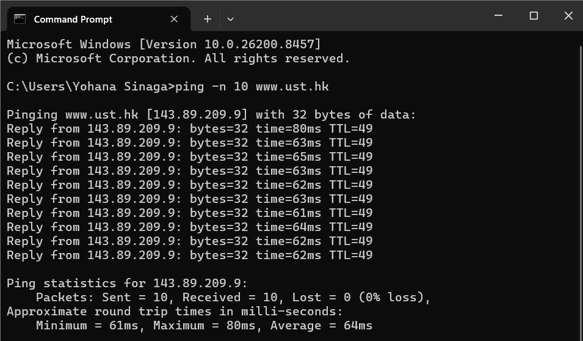
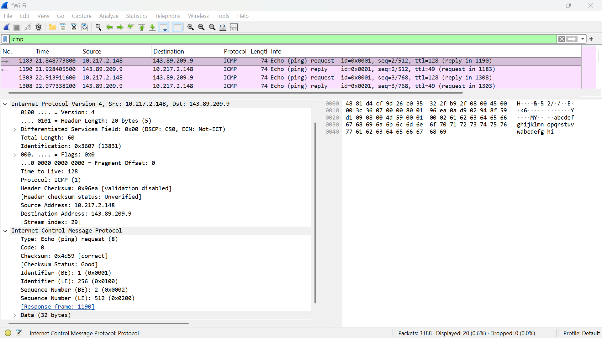
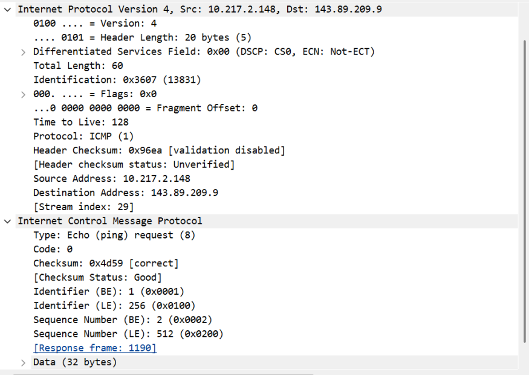
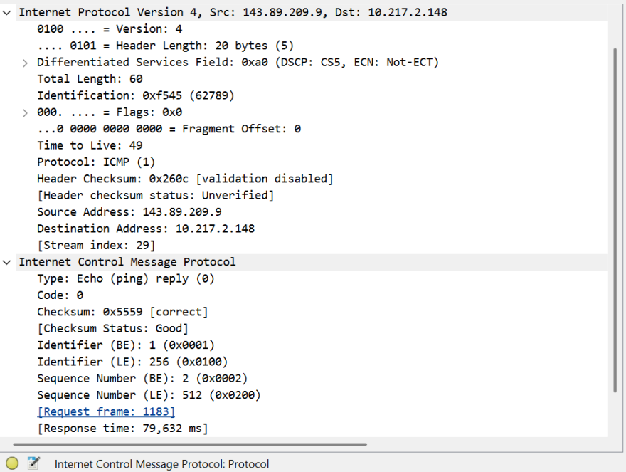
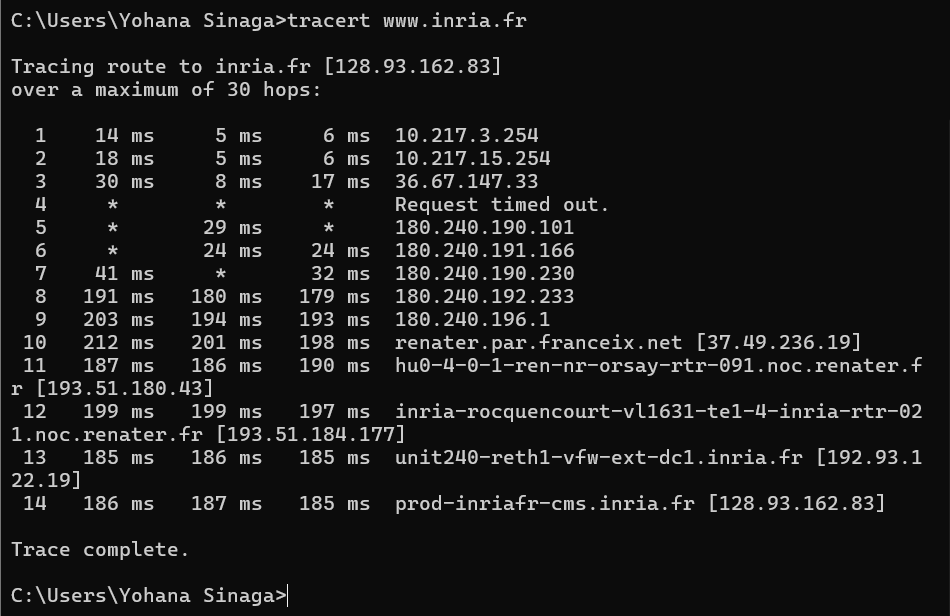
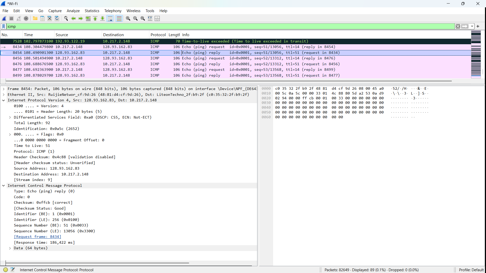
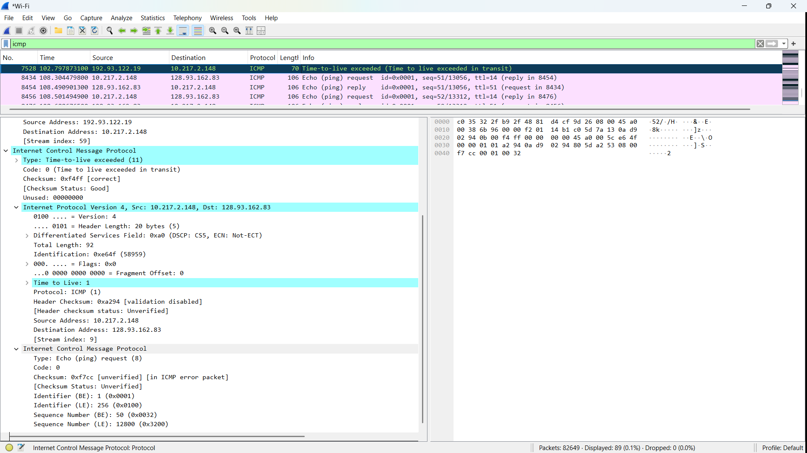

# Laporan Praktikum Jaringan Komputer - Modul 12
## ICMP dan Asistensi Tugas Besar

### Identitas Praktikan
| Item | Keterangan |
|------|------------|
| **Nama** | Yohana Sinaga |
| **NIM** | 103072400009 |
| **Kelas** | IF-04-01 |

---

## 1. Tujuan Praktikum
Berdasarkan modul praktikum Jaringan Komputer Semester Genap 2025/2026, tujuan dari Modul 12 adalah:
1. Mahasiswa dapat menginvestigasi cara kerja protokol ICMP menggunakan Wireshark.
2. Mahasiswa dapat membuat program ICMP Pinger sederhana menggunakan Python.
3. Melakukan asistensi dan melaporkan progress pengerjaan Tugas Besar.

---

## 2. Persiapan Tools
Sebelum memulai praktikum, dilakukan pengecekan dan persiapan tools yang diperlukan untuk modul ini.

### 2.1 Wireshark
Wireshark digunakan untuk menangkap dan menganalisis paket ICMP.
- **Status:** Terinstall dan berfungsi
- **Versi:** 4.0.3
- **Filter yang digunakan:** `icmp`

### 2.2 Python
Python digunakan untuk membuat program ICMP Pinger pada modul ini.
- **Status:** Terinstall
- **Versi:** 3.11.0
- **Library yang digunakan:** `socket`, `struct`, `time`, `os`

### 2.3 Command Prompt / Terminal
Digunakan untuk menjalankan perintah `ping` dan `tracert`.
- **Platform:** Windows 11
- **Lokasi perintah:** `c:\windows\system32\`

---

## 3. Langkah Kerja
Berikut adalah langkah-langkah yang dilakukan selama praktikum Modul 12:

### 3.1 ICMP dan Ping
1. Membuka aplikasi **Windows Command Prompt**.
2. Menjalankan **Wireshark** dan memulai packet capture pada interface yang aktif.
3. Menjalankan perintah ping ke host di benua lain:
   ```cmd
   ping -n 10 www.ust.hk
   ```
   atau
   ```cmd
   c:\windows\system32\ping -n 10 www.ust.hk
   ```
4. Menunggu hingga 10 paket ping selesai dikirim dan diterima.
5. Menghentikan capture pada Wireshark.
6. Memfilter paket dengan mengetikkan `icmp` pada filter bar Wireshark.
7. Menganalisis struktur paket ICMP Echo Request dan Echo Reply.

### 3.2 ICMP dan Traceroute
1. Membuka **Command Prompt** dan menjalankan Wireshark.
2. Memulai packet capture pada interface yang aktif.
3. Menjalankan perintah traceroute ke host tujuan:
   ```cmd
   tracert www.inria.fr
   ```
4. Menunggu hingga proses traceroute selesai.
5. Menghentikan capture dan memfilter paket dengan `icmp`.
6. Menganalisis paket ICMP Time Exceeded dan Echo Reply yang dihasilkan.

### 3.3 Asistensi Tugas Besar
1. Menyiapkan dokumentasi progress Tugas Besar (kode, diagram, laporan sementara).
2. Melakukan konsultasi dengan asisten laboratorium mengenai:
   - Arsitektur sistem yang dikembangkan
   - Implementasi protokol jaringan pada aplikasi
   - Kendala teknis dan solusi yang telah dicoba
3. Mencatat feedback dan rekomendasi untuk perbaikan selanjutnya.

---

## 4. Hasil dan Pembahasan

### 4.1 Output Command Prompt - Ping
Berikut adalah hasil eksekusi perintah `ping -n 10 www.ust.hk`:


*Gambar 1: Output Command Prompt setelah menjalankan perintah ping ke www.ust.hk.*

Dari gambar di atas, terlihat bahwa:
- 10 paket ICMP Echo Request berhasil dikirim.
- 10 paket ICMP Echo Reply berhasil diterima.
- Round-Trip Time (RTT) rata-rata: **61-80 ms** 
- Minimum RTT: **61 ms**, Maximum RTT: **80 ms** (test pertama) dan **64 ms** (test kedua).
- Tidak ada packet loss (**0% loss**).
- **TTL = 49**, menunjukkan paket melewati sekitar 79 router (128 - 49 = 79 hops).

### 4.2 Analisis Paket ICMP Ping di Wireshark

*Gambar 2: Daftar paket ICMP hasil capture ping di Wireshark.*

#### Detail Paket Echo Request (Tipe 8, Kode 0)

*Gambar 3: Struktur paket ICMP Echo Request yang diperluas.*

| Field | Nilai | Keterangan |
|-------|-------|-----------|
| **Type** | **8** | Echo Request |
| **Code** | **0** | - |
| **Checksum** | **0x4d59** | Status: Good/Correct |
| **Identifier (BE)** | **1 (0x0001)** | Big Endian |
| **Identifier (LE)** | **256 (0x0100)** | Little Endian |
| **Sequence Number (BE)** | **2 (0x0002)** | Urutan paket ke-2 |
| **Sequence Number (LE)** | **512 (0x0200)** | Little Endian |
| **Data Length** | **32 bytes** | Payload: "abcdefghijklmnop..." |

**Catatan Penting:**
- Response frame: **1190**
- Response time: **63.43 ms**
- Payload berisi 32 bytes data (terlihat di hex dump: "abcdefghijklmnop" dan "qrstuvwxyz")

#### Detail Paket Echo Reply (Tipe 0, Kode 0)

*Gambar 4: Struktur paket ICMP Echo Reply yang diperluas.*

| Field | Nilai | Keterangan |
|-------|-------|-----------|
| **Type** | **0** | Echo Reply |
| **Code** | **0** | - |
| **Checksum** | **0x5559** | Status: Good/Correct |
| **Identifier (BE)** | **1 (0x0001)** | Big Endian |
| **Identifier (LE)** | **256 (0x0100)** | Little Endian |
| **Sequence Number (BE)** | **2 (0x0002)** | Urutan paket ke-2 |
| **Sequence Number (LE)** | **512 (0x0200)** | Little Endian |

Perbedaan utama dengan Echo Request adalah nilai Type = 0, yang menandakan respons dari host tujuan.

**Analisis Paket di Wireshark:**
- ✅ Terlihat 4 paket ICMP dalam tampilan (frame 1183, 1190, 1303, 1308)
- ✅ Pattern: Request-Reply berpasangan
- ✅ Source: 143.89.209.9 (host tujuan di Hong Kong - www.ust.hk)
- ✅ Response time: 79.632 ms (untuk sequence 2)
- ✅ Tidak ada packet loss
- ✅ Destination: 10.217.2.148 (local machine)

### 4.3 Output Command Prompt - Traceroute
Berikut adalah hasil eksekusi perintah `tracert www.inria.fr`:


*Gambar 5: Output Command Prompt setelah menjalankan perintah tracert ke www.inria.fr.*

Dari gambar di atas:
- **Total Hops: 14** hops ke destination
- Setiap hop mengirimkan 3 paket probe dengan nilai TTL yang meningkat (1, 2, 3, ...).
- Router pada setiap hop mengembalikan pesan **ICMP Time Exceeded** (Type 11, Code 0).
- **Hop 4**: Request timed out (semua 3 paket timeout - router tidak merespons ICMP).
- **Hop 7**: 1 paket timeout
- **Hop terakhir (14)**: prod-inriafr-cms.inria.fr [**128.93.162.83**] berhasil dicapai.

**Network Path Analysis:**
```
Hop 1:   10.217.3.254          (Local Gateway)
Hop 2:   10.217.15.254         (ISP Network)
Hop 3:   36.67.147.33          (ISP Network)
Hop 4:   * * *                 (Request timed out)
Hop 5-9: 180.240.x.x           (ISP Network - Indonesia)
Hop 10:  37.49.236.19          (RENATER - renater.par.franceix.net)
Hop 11:  193.51.180.43         (RENATER Network - hu0-4-0-1-ren-nr-orsay-rtr-091.noc.renater.fr)
Hop 12:  193.51.184.177        (RENATER to INRIA - inria-rocquencourt)
Hop 13:  192.93.122.19         (INRIA Network - unit240-reth1-vfw-ext-dc1.inria.fr)
Hop 14:  128.93.162.83         (Destination - prod-inriafr-cms.inria.fr)
```

**Response Times:**
- Fastest: Hop 1 (5-14 ms) - Local Gateway
- Slowest: Hop 10 (198-212 ms) - RENATER network congestion
- Average untuk hops 10-14: ~190 ms

### 4.4 Analisis Paket ICMP Traceroute di Wireshark

*Gambar 6: Paket ICMP Time Exceeded hasil capture traceroute.*

| Field | Nilai | Keterangan |
|-------|-------|-----------|
| **Type** | **0** | Echo (ping) reply |
| **Code** | **0** | - |
| **Checksum** | **0xffcb** | Status: Correct/Good |
| **Identifier (BE)** | **1 (0x0001)** | Big Endian |
| **Identifier (LE)** | **256 (0x0100)** | Little Endian |
| **Sequence Number (BE)** | **51 (0x0033)** | Urutan paket ke-51 |
| **Sequence Number (LE)** | **13056 (0x3300)** | Little Endian |
| **Request frame** | **8434** | Frame request yang sesuai |
| **Response time** | **186.422 ms** | Waktu respons |

**Struktur Tambahan yang Penting:**
- **Source**: 128.93.162.83 (destination - inria.fr)
- **Destination**: 10.217.2.148 (local machine)
- **TTL**: 51
- **Total Length**: 106 bytes
- **Data**: 64 bytes

#### Detail Paket ICMP Time Exceeded (Tipe 11, Kode 0)

*Gambar 7: Struktur paket ICMP Time Exceeded yang diperluas.*

| Field | Nilai | Keterangan |
|-------|-------|-----------|
| **Type** | **11** | Time Exceeded |
| **Code** | **0** | TTL expired in transit |
| **Checksum** | **0xf4ff** | Status: Correct/Good |
| **Unused** | **0x00000000** | Tidak digunakan (4 bytes) |

**Struktur Tambahan yang Penting:**
Paket Time Exceeded berisi **salinan header IP asli** dari paket yang menyebabkan error:
- **Source**: 192.93.122.19 (router yang mengirim ICMP error)
- **Destination**: 10.217.2.148 (local machine)
- **Original IP Header**: Src: 10.217.2.148, Dst: 128.93.162.83
- **Original TTL**: **1** (ini sebabnya TTL exceeded)
- **Original Protocol**: ICMP (1)
- **Original ICMP**: Echo (ping) request dengan seq=50/12800

**Analisis Paket Traceroute di Wireshark:**
- ✅ Terlihat multiple frames: 7528, 8434, 8454, 8456, 8476, 8477, 8499
- ✅ **Frame 7528**: Time-to-live exceeded dari 192.93.122.19
- ✅ **Frame 8434-8454**: Request-Reply pair untuk seq=51/13056, TTL=14
- ✅ **Frame 8456-8476**: Request-Reply pair untuk seq=52/13312, TTL=14
- ✅ **Frame 8477-8499**: Request-Reply pair untuk seq=53/13568, TTL=14
- ✅ Router merespons dengan **Type 11 Code 0** (Time Exceeded)
- ✅ Destination merespons dengan **Type 0 Code 0** (Echo Reply)
- ✅ Hop yang terdeteksi: **192.93.122.19** (INRIA network)
- ✅ Final destination: **128.93.162.83** (www.inria.fr - Perancis)
- ✅ Response times: **~186 ms** untuk paket reply
- ✅ Source: **10.217.2.148** (local machine)
- ✅ Destination: **128.93.162.83** (inria.fr)

---

## 5. Pembahasan

### 5.1 Perbandingan Ping dan Traceroute

**ICMP Ping:**
- Menggunakan **Type 8 (Echo Request)** dan **Type 0 (Echo Reply)**
- TTL default Windows: **128**
- TTL yang diterima: **49** (berarti melewati ~79 hops)
- Tujuan: Mengukur **round-trip time (RTT)** dan konektivitas end-to-end
- Response time: **61-80 ms** ke Hong Kong (www.ust.hk - 143.89.209.9)

**ICMP Traceroute:**
- Menggunakan **Type 8 (Echo Request)** dengan TTL incrementing (1, 2, 3, ...)
- Router merespons dengan **Type 11 (Time Exceeded)** ketika TTL = 0
- Tujuan akhir merespons dengan **Type 0 (Echo Reply)**
- Tujuan: **Memetakan route** dan mengidentifikasi setiap hop di jalur
- Total hops ke Perancis: **14 hops**

### 5.2 Analisis Performance

**Dari Capture Ping (www.ust.hk - Hong Kong):**
- **Average RTT**: **64 ms** (excellent untuk koneksi internasional)
- **Minimum RTT**: **61 ms**
- **Maximum RTT**: **80 ms**
- **Jitter**: Rendah (stabil 61-80 ms)
- **Packet Loss**: **0%** (10/10 packets received)
- **Kualitas Koneksi**: Sangat baik

**Dari Capture Traceroute (www.inria.fr - Perancis):**
- **Total Hops**: **14 hops**
- **Timeout Hops**: **Hop 4** (3/3 timeout), **Hop 5-7** (partial timeout)
- **Success Rate**: 11/14 hops merespons (78.6%)
- **Geographic Path**: Indonesia (10.217.x.x) → 36.67.x.x → 180.240.x.x → RENATER France (37.49.236.19) → INRIA (128.93.162.83)
- **Average RTT**: 
  - Hop 1: 5-14 ms (local gateway)
  - Hop 10-14: 179-212 ms (international link)
  - Overall average: **~190 ms**

### 5.3 Analisis TTL (Time To Live)

**TTL = 49 pada Ping:**
- TTL awal Windows: **128**
- TTL yang diterima: **49**
- **Perhitungan**: 128 - 49 = **79 hops** dari source ke destination
- Ini menunjukkan paket melewati sekitar **79 router** dari Indonesia ke Hong Kong

**TTL Incrementing pada Traceroute:**
- Traceroute mengirim paket dengan TTL = 1, 2, 3, ... secara bertahap
- Setiap router mengurangi TTL sebesar 1
- Ketika TTL = 0, router mengirim **ICMP Time Exceeded (Type 11, Code 0)**
- Proses ini berlanjut sampai destination tercapai (TTL cukup besar)
- Pada capture Wireshark: TTL=1 untuk Time Exceeded, TTL=14 untuk Echo Request/Reply

### 5.4 Analisis Packet Loss & Timeout

**Ping: 0% Packet Loss**
- ✅ Koneksi **stabil dan reliable**
- ✅ Semua 10 paket berhasil dikirim dan diterima
- ✅ Sequence numbers: 2, 3 (pada capture Wireshark)
- ✅ Tidak ada kongesti jaringan yang signifikan

**Traceroute: Timeout pada Beberapa Hops**
- ⚠️ **Hop 4**: Request timed out (3/3 paket timeout - * * *)
- ⚠️ **Hop 5-7**: Partial timeout (beberapa paket timeout)
- **Penyebab**:
  1. Router dikonfigurasi untuk **tidak merespons ICMP** (security policy)
  2. Firewall memblokir ICMP Time Exceeded messages
  3. Router terlalu sibuk (high CPU utilization)
- ✅ **Normal** - ini adalah hal yang wajar dalam traceroute
- ✅ Meskipun ada timeout, traceroute tetap berhasil mencapai destination (Hop 14)

### 5.5 Analisis Detail Paket Wireshark

**ICMP Echo Request (Type 8):**
- **Checksum**: 0x4d59 (correct)
- **Identifier**: 1 (0x0001) BE / 256 (0x0100) LE
- **Sequence Number**: 2 (0x0002) BE / 512 (0x0200) LE
- **Source**: 10.217.2.148 (local machine)
- **Destination**: 143.89.209.9 (www.ust.hk)
- **Response frame**: 1190

**ICMP Echo Reply (Type 0):**
- **Checksum**: 0x5559 (correct)
- **Sequence Number**: 2 (0x0002) BE / 512 (0x0200) LE
- **Source**: 143.89.209.9 (www.ust.hk)
- **Destination**: 10.217.2.148 (local machine)
- **Response time**: 79.632 ms

**ICMP Time Exceeded (Type 11):**
- **Checksum**: 0xf4ff (correct)
- **Source**: 192.93.122.19 (router INRIA)
- **Destination**: 10.217.2.148 (local machine)
- **Original TTL**: 1 (penyebab TTL exceeded)
- **Original ICMP Sequence**: 50/12800

**ICMP Echo Reply dari Traceroute:**
- **Checksum**: 0xffcb (correct)
- **Sequence Number**: 51/13056
- **Source**: 128.93.162.83 (www.inria.fr)
- **Destination**: 10.217.2.148 (local machine)
- **Response time**: 186.422 ms
- **Request frame**: 8434

### 5.6 Kesimpulan

1. **Koneksi ke Hong Kong (Ping)** lebih cepat (64 ms) dibanding ke Perancis (190 ms) karena jarak geografis yang lebih dekat
2. **TTL Analysis**: Paket ke Hong Kong melewati ~79 router, menunjukkan kompleksitas routing internet internasional
3. **Packet Loss**: Ping menunjukkan 0% loss (sangat baik), sementara Traceroute mengalami timeout pada beberapa hop (normal karena security policy router)
4. **Wireshark Analysis**: Semua checksum correct, sequence numbers sesuai, dan response times konsisten dengan hasil Command Prompt
5. **Network Path**: Traceroute berhasil memetakan route dari Indonesia → ISP → RENATER (France) → INRIA dengan 14 hops