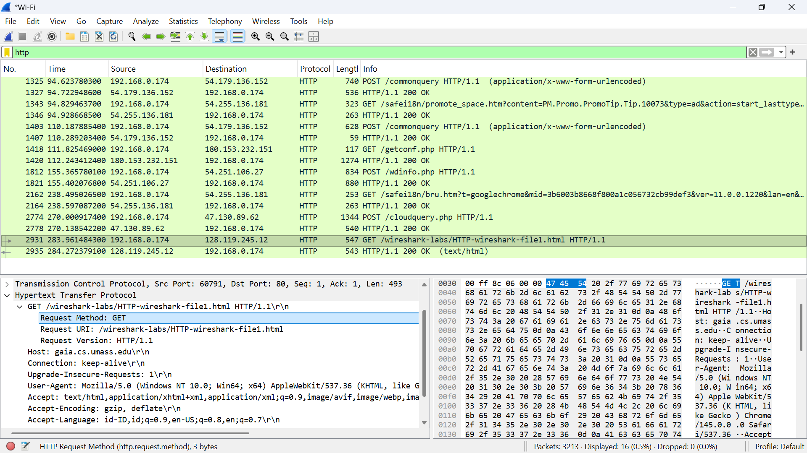
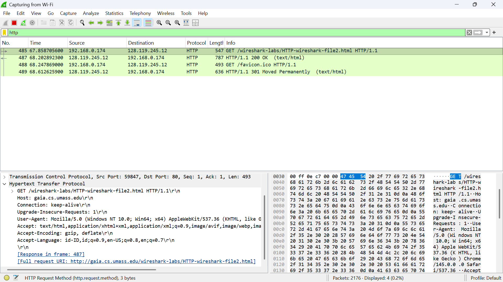
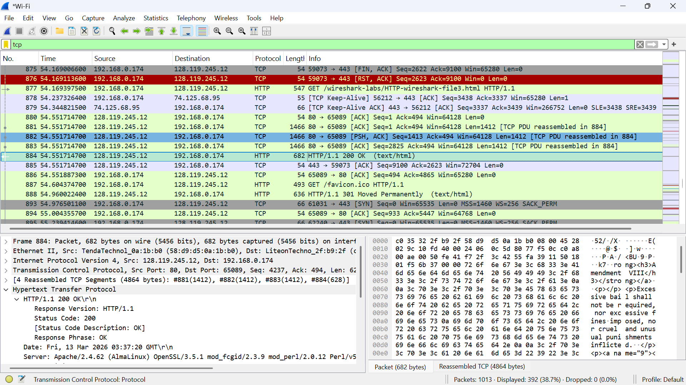
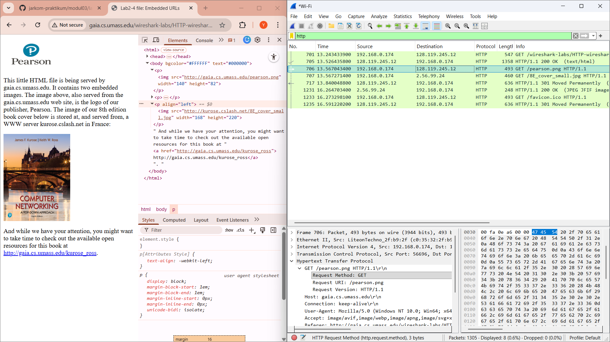
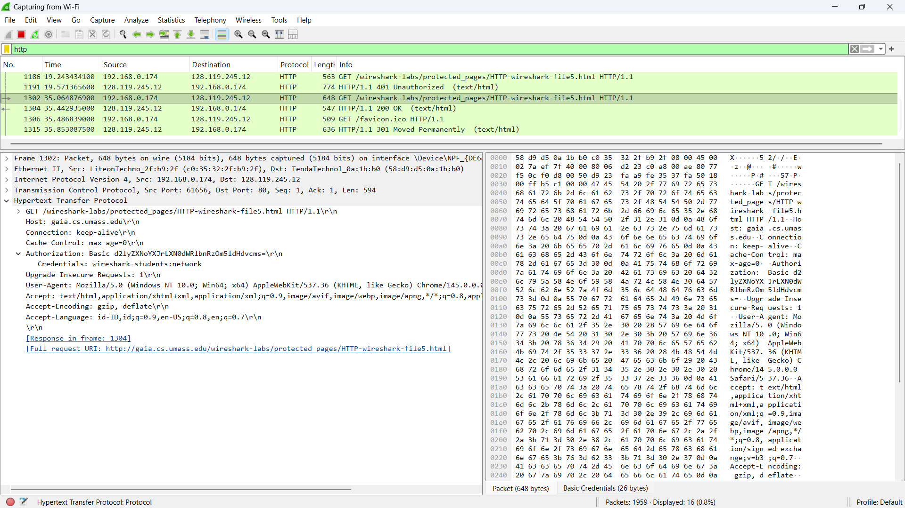

# Laporan Praktikum Jaringan Komputer - Modul 3
## HTTP Protocol Analysis

### Identitas Praktikan
| Item | Keterangan |
|------|------------|
| **Nama** | Yohana Sinaga |
| **NIM** | 103072400009 |
| **Kelas** | IF-04-01 |

---

## 1. Tujuan Praktikum
Berdasarkan modul praktikum Jaringan Komputer Semester Genap 2025/2026, tujuan dari Modul 3 adalah:
1. Mahasiswa dapat menginvestigasi cara kerja protokol HTTP menggunakan Wireshark.
2. Mahasiswa memahami interaksi dasar HTTP GET/Response, Conditional GET, pengambilan dokumen panjang, objek tertanam (embedded objects), dan autentikasi HTTP.

---

## 2. Dasar Teori
**HTTP (Hypertext Transfer Protocol)** adalah protokol lapisan aplikasi yang digunakan untuk mendistribusikan informasi di World Wide Web. HTTP menggunakan model request-response antara klien (browser) dan server.

Beberapa aspek penting HTTP yang dianalisis dalam modul ini:
1. **Basic GET/Response:** Interaksi dasar dimana klien meminta dokumen dan server merespons dengan status code (misal: 200 OK).
2. **Conditional GET:** Mekanisme caching dimana klien meminta dokumen hanya jika dokumen tersebut telah dimodifikasi sejak terakhir diakses (header `If-Modified-Since`).
3. **HTTP & TCP:** Dokumen besar dipecah menjadi beberapa segmen TCP ("TCP segment of a reassembled PDU").
4. **Embedded Objects:** Halaman HTML yang memuat objek lain (gambar) akan memicu multiple HTTP GET requests.
5. **HTTP Authentication:** Mekanisme keamanan dasar dimana kredensial dikirimkan dalam header `Authorization` (biasanya encoded Base64).

---

## 3. Langkah Kerja
Berikut adalah langkah-langkah yang dilakukan selama praktikum Modul 3:

### 3.1 Basic HTTP GET/Response Interaction
1. Membersihkan cache browser.
2. Menjalankan Wireshark dan mengatur filter `http`.
3. Mengakses URL: `http://gaia.cs.umass.edu/wireshark-labs/HTTP-wireshark-file1.html`.
4. Menghentikan capture dan menganalisis paket HTTP GET dan OK.

### 3.2 HTTP Conditional GET/Response Interaction
1. Membersihkan cache browser.
2. Menjalankan Wireshark.
3. Mengakses URL: `http://gaia.cs.umass.edu/wireshark-labs/HTTP-wireshark-file2.html`.
4. Melakukan refresh halaman (akses URL yang sama untuk kedua kalinya).
5. Menganalisis header `If-Modified-Since` dan respons `304 Not Modified`.

### 3.3 Retrieving Long Documents
1. Membersihkan cache browser.
2. Mengakses URL: `http://gaia.cs.umass.edu/wireshark-labs/HTTP-wireshark-file3.html`.
3. Menganalisis respons TCP multi-paket untuk dokumen besar.

### 3.4 HTML Documents dengan Embedded Objects
1. Membersihkan cache browser.
2. Mengakses URL: `http://gaia.cs.umass.edu/wireshark-labs/HTTP-wireshark-file4.html`.
3. Menganalisis jumlah request HTTP GET yang terjadi (HTML + Gambar).

### 3.5 HTTP Authentication
1. Membersihkan cache browser.
2. Mengakses URL: `http://gaia.cs.umass.edu/wireshark-labs/protected_pages/HTTP-wireshark-file5.html`.
3. Memasukkan username: `wireshark-students` dan password: `network`.
4. Menganalisis header `Authorization: Basic`.

---

## 4. Hasil dan Pembahasan

### 4.1 Basic HTTP GET/Response
Pada percobaan pertama, diakses file HTML sederhana. Wireshark menangkap dua pesan utama: HTTP GET dari klien dan HTTP OK dari server.

*Gambar 1: Tangkapan layar Wireshark menunjukkan paket HTTP GET dan Response 200 OK.*

**Analisis:**
- **Request:** Metode `GET`, Host `gaia.cs.umass.edu`.
- **Response:** Status Code `200 OK`, Content-Type `text/html`.
- Protokol HTTP dibawa di atas segmen TCP, datagram IP, dan frame Ethernet.

### 4.2 HTTP Conditional GET
Pada percobaan ini, halaman diakses dua kali. Akses kedua memanfaatkan cache browser.

*Gambar 2: Tangkapan layar Wireshark menunjukkan header If-Modified-Since dan respons 304.*

**Analisis:**
- Pada request kedua, muncul header `If-Modified-Since`.
- Server merespons dengan status code `304 Not Modified`, yang berarti browser tidak perlu mengunduh ulang konten karena tidak ada perubahan. Ini menghemat bandwidth.

### 4.3 Retrieving Long Documents
Mengakses dokumen "Bill of Rights" yang cukup panjang (sekitar 4500 byte).

*Gambar 3: Tangkapan layar Wireshark menunjukkan TCP segment of a reassembled PDU.*

**Analisis:**
- Respons HTTP tidak muat dalam satu paket TCP.
- Wireshark menampilkan keterangan `[TCP segment of a reassembled PDU]`.
- Ini menunjukkan bahwa lapisan transportasi (TCP) memecah data besar menjadi segmen-segmen kecil sebelum dikirim.

### 4.4 HTML Documents dengan Embedded Objects
Mengakses halaman HTML yang mengandung dua gambar yang disimpan di server berbeda.

*Gambar 4: Tangkapan layar Wireshark menunjukkan multiple HTTP GET requests.*

**Analisis:**
- Terlihat lebih dari satu request HTTP GET.
- Satu GET untuk file HTML utama.
- GET tambahan untuk mengambil objek gambar (embedded objects) yang direferensikan dalam HTML.
- Browser melakukan request secara paralel atau berurutan untuk setiap objek.

### 4.5 HTTP Authentication
Mengakses halaman yang dilindungi password.

*Gambar 5: Tangkapan layar Wireshark menunjukkan header Authorization Basic.*

**Analisis:**
- Request pertama ditolak server dengan status `401 Authorization Required`.
- Client mengirim ulang GET dengan header `Authorization: Basic`.
- Kredensial (username dan password) di-encode menggunakan **Base64**.
- **Keamanan:** Base64 bukan enkripsi, melainkan encoding. Siapa saja yang menangkap paket dapat mendekode kembali username dan password menggunakan decoder Base64 online. Ini menunjukkan HTTP Basic Auth tidak aman tanpa HTTPS (SSL/TLS).

---

## 5. Kesimpulan
Berdasarkan praktikum Modul 3 ini, dapat disimpulkan bahwa:
1. **Wireshark** efektif untuk menganalisis transaksi HTTP secara detail (header, method, status code).
2. **HTTP bersifat stateless**, namun mekanisme caching (Conditional GET) membantu efisiensi jaringan.
3. **TCP** bertanggung jawab memecah data besar menjadi segmen-segmen (fragmentasi di lapisan transport) untuk dokumen HTML yang panjang.
4. **Embedded Objects** menyebabkan terjadinya multiple HTTP request untuk satu halaman web yang kompleks.
5. **HTTP Basic Authentication** tidak aman karena kredensial hanya di-encode (Base64) dan dapat dengan mudah dibaca oleh packet sniffer jika tidak menggunakan enkripsi lapisan bawah (HTTPS).

---

## 6. Daftar Pustaka
1. Kurose, J.F., & Ross, K.W. (2021). *Computer Networking: A Top-Down Approach*, 8th Edition. Pearson.
2. Universitas Telkom. (2026). *Modul Praktikum Jaringan Komputer Semester Genap 2025/2026*. Fakultas Informatika.
3. Wireshark Foundation. (2024). *Wireshark User's Guide*. Retrieved from https://www.wireshark.org/docs/

---

> 💡 **Catatan:** 
> - Pastikan folder `assets/` berisi semua file gambar tangkapan layar Wireshark sesuai nama yang direferensikan.
> - File ini dapat langsung digunakan sebagai `README.md` pada repository Git praktikum Anda.
> - Untuk menampilkan gambar di GitHub/GitLab, pastikan path relatif `assets/` sesuai dengan struktur direktori proyek.